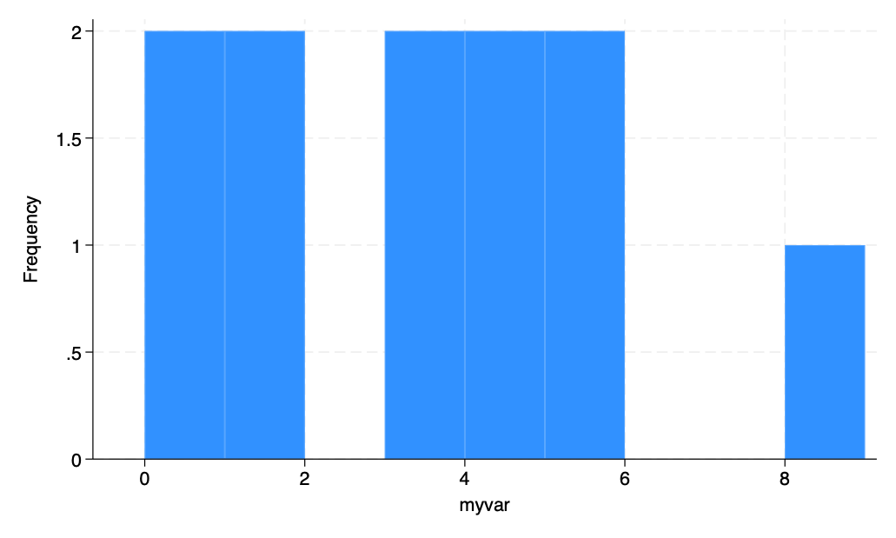
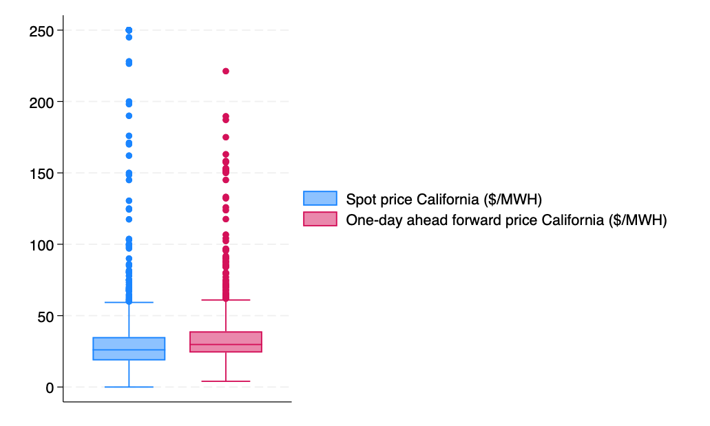
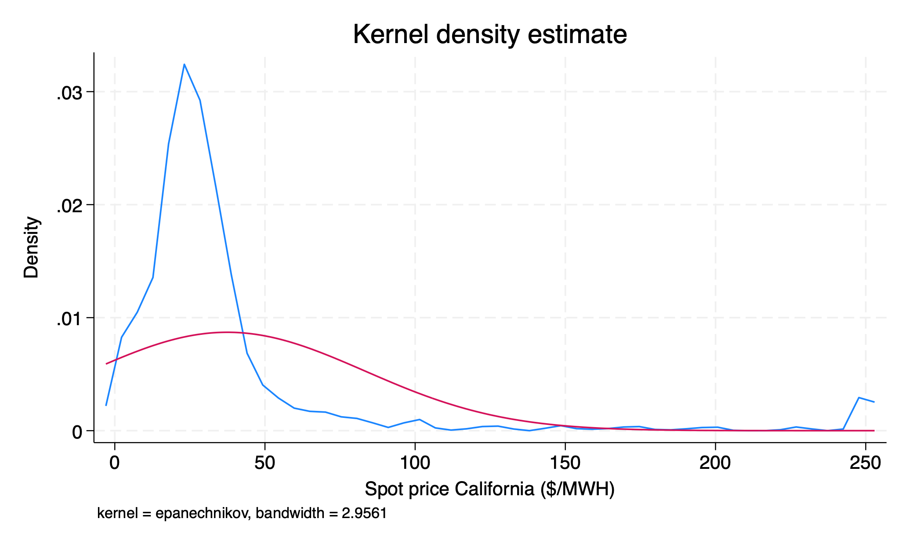
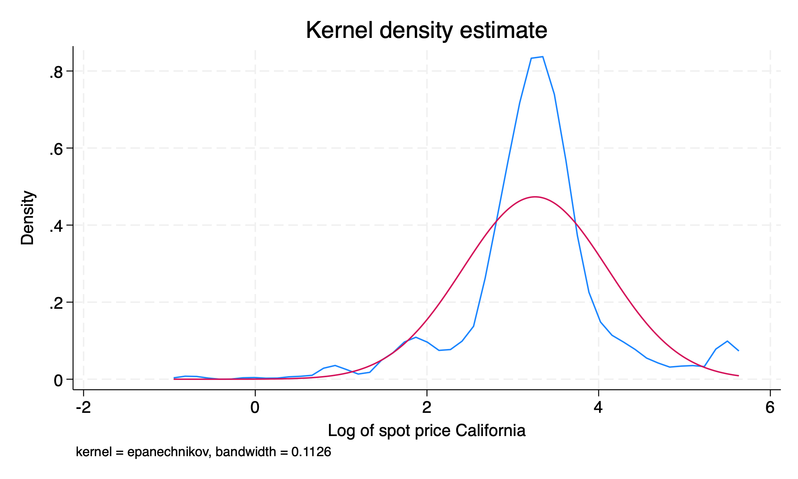
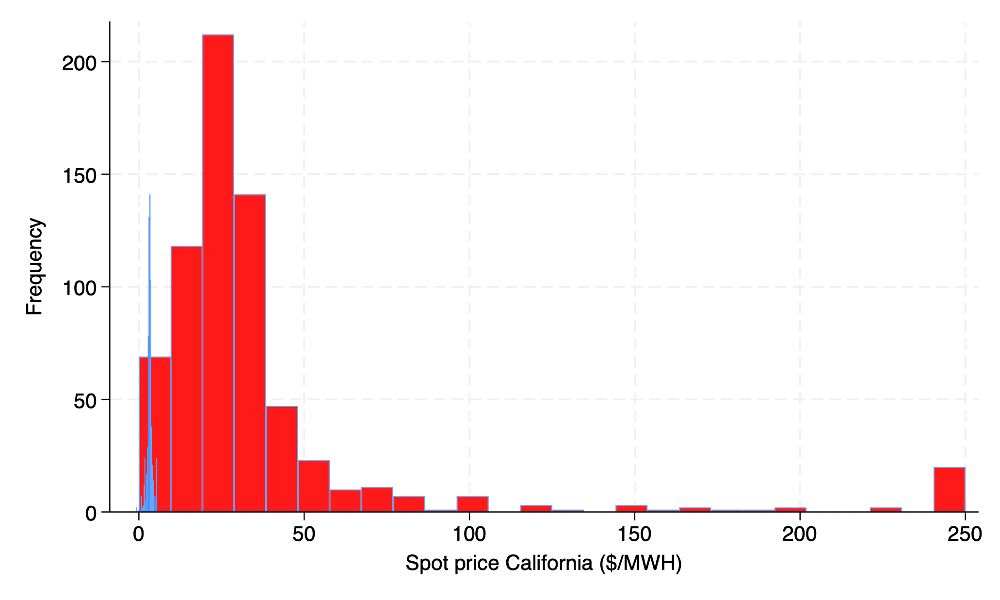

```{r}
#| label: setup
#| include: false
require("Statamarkdown")
```

# Question 1: Data types

Give an example of the following types of data:

a) Observational, categorical, time-series data **What is my most-visited coffee shop each month for 12 months?**

b) Observational, numerical, panel data **How many times does each student in 102 visit the Canvas page each month throughout the quarter?**

c) Experimental, discrete numerical, cross-sectional data **How many cases of COVID do treated individuals in a vaccine trial develop relative to a placebo group?**

d) Experimental, categorical, repeated cross-sectional data **Which of 5 new flavors of a drink do multiple waves of subjects prefer in a brand experiment?**

What type of data are the following:

e) Midterm 1 scores for one class of ECN 102 **observational, continuous numerical, cross-sectional**

f) Final grades (%) for ECN 102 from the last 5 years **observational, continuous numerical, repeated cross-section**

g) All homework grades (graded pass/fail) for one student in ECN 102 this quarter **observational, categorical, time-series data**

h) All homework grades (graded pass/fail) for all students in ECN 102 this quarter **observational, categorical, panel**

# Question 2: Univariate data

For the given sample 0, 4, 5, 2, 3, 2, 11, 17, 6:

a) Calculate the mean, median, mode, variance, and standard deviation from first principles $\boldsymbol{\bar{x}= 5.\bar{5}, Median = 4, Mode=2,s^2=28.3,s=5.3}$

b) Without using the formula, is this data symmetric or skewed? How do you know? Is it normally distributed? **Since $\boldsymbol{\bar{x}> Median}$, the data is right-skewed and not symmetric. This means it cannot be normal.**

c) How would your above calculations change if we subtracted 7 from each observation? If we multiplied by 2 and *then* subtracted 7? How do these differ? **Addition and subtraction does not affect our measures of spread and would shift our measures of central tendency down by 7. Multiplying by two and subtracting 7 would shift our measures of spread by $2^2$ ($s^2$) or 2 (s) and our measures of central tendency by $2x-7$.**

d) Compute z-scores for each observation. What is the mean of these z-scores? What is the standard deviation? Does this surprise you? $\boldsymbol{z_i=\frac{x_i-5.\bar{5}}{5.3}}$; $z\sim(0,1)$ **as we expect.**

e) Do you expect these z-scores to be normally distributed? Why or why not? **No. As our underlying sample is not normally distributed, standardizing our data will not make it become normal.**

# Question 3: Manual data entry

Use the following code to input *some* data into your Stata browser (it does not have to match my data) and compute summary statistics.

```{stata}
#| collectcode: true
input myvar // this can be any name you wish
0
3
5
1
4
0
9
3
1
4
5
end
summarize myvar, detail
```

a) What is the IQR of your data? What is the skewness and kurtosis? What do these values mean? **IQR = 75%ile-25%ile. Skewness > 0 is right-skewed, < 0 is left-skewed. Kurtosis > 3 means fatter tails than the normal; < 3 means thinner tails.**

b) Obtain a table of frequencies for your data using `tabulate [varname]`.

```{stata}
tab myvar
```

c) Give a histogram of the data with bin width one using `histogram [varname], width(1) frequency`.

```{stata}
#| results: false
histogram myvar, w(1) freq
graph export hw1hist.png, replace
```

{width=100% fig-alt="Bar histogram of a sample dataset with values 0–9, bin width 1, and frequency on the y-axis, showing the count for each integer value. The distribution is right-skewed with the most common values at 0, 3, and 5, and a long tail toward 9."}

\newpage

# Question 4: Data in Stata

Download AED_CALELECTRICITY.DTA from the website above and bring it into Stata.

a) Describe the data using `describe` — what variables are here? What do they correspond to?

```{stata}
#| collectcode: true
qui use AED_CALELECTRICITY, clear
describe
```

b) Obtain a box plot for both the spot price and one-day ahead forward price of electricity using *graph box [varnames]* and save it with `graph export myboxplot.png, replace`.

```{stata}
#| results: false
graph box niso npx
graph export hw1box.png, replace
```

{width=100% fig-alt="Side-by-side box plots of two California electricity price series: niso (spot price) and npx (one-day ahead forward price), displaying the median, interquartile range, whiskers, and outliers for each series."}

\newpage

c) Obtain summary statistics for both series. Which has a higher degree of dispersion? Are they symmetric or skewed?

```{stata}
#| echo: true
summarize niso npx, detail
```

**To compare dispersion, we should compare the coefficient of variation, $\boldsymbol{CV=\frac{s}{\bar{x}}}$.**

**$\boldsymbol{CV_{niso}=\frac{45.8}{37.5}>CV_{npx}=\frac{27.1}{37.2}}$, so the spot price has higher dispersion.**

d) Log transform the spot price variable and create a new variable *ln_niso* using `generate ln_niso = ln(niso)`. Label this variable "Log of spot price California" using `label variable ln_niso [VARLABEL]`

```{stata}
#| echo: true
#| results: false
#| collectcode: true
gen ln_niso = ln(niso)
la var ln_niso "Log of spot price California"
```

e) Plot the kernel density functions of both *niso* and *ln_niso* (in separate graphs) against a normal density function with `kdensity [varname], normal`. How does the shape of the distribution change? Is this surprising? Which appears more normal?

```{stata}
#| results: false
kdensity niso, normal legend(off)
graph export hw1nisonormal.png, replace
kdensity ln_niso, normal legend(off)
graph export hw1nisoln.png, replace
```

{width=100% fig-alt="Kernel density estimate of the California spot electricity price (niso) overlaid with a normal density curve. The distribution is strongly right-skewed with a long right tail, departing substantially from the normal overlay."}

{width=100% fig-alt="Kernel density estimate of the log-transformed California spot electricity price (ln_niso) overlaid with a normal density curve. The distribution is much closer to normal than the untransformed series, with substantially reduced right skew."}

**The data becomes less right-skewed and more normal with the log transformation, as we expect. Log transformations can be used to somewhat normalize right-skewed data.**

f) Plot a histogram of *niso* and *ln_niso* together on the same graph with the code below. Does this look strange? Why might this be?

```{stata}
#| results: false
histogram niso, freq legend(off) fcolor(red) addplot(hist ln_niso, freq fcolor(blue))
graph export hw1badhist.png, replace
```

{width=100% fig-alt="Overlapping histograms of the California spot electricity price in levels (niso, red bars) and in logs (ln_niso, blue bars) plotted on the same frequency scale, illustrating why overlaying series measured on different scales produces a misleading chart."}

**This looks strange, as the data are on different scales. One is in levels, one is in logs. This is not a good histogram for us to show!**
