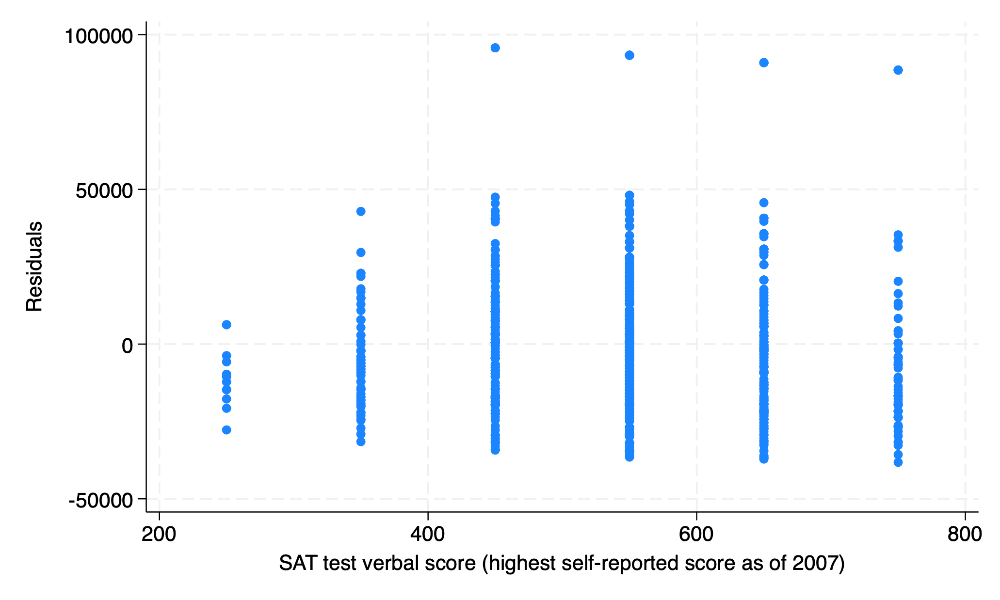
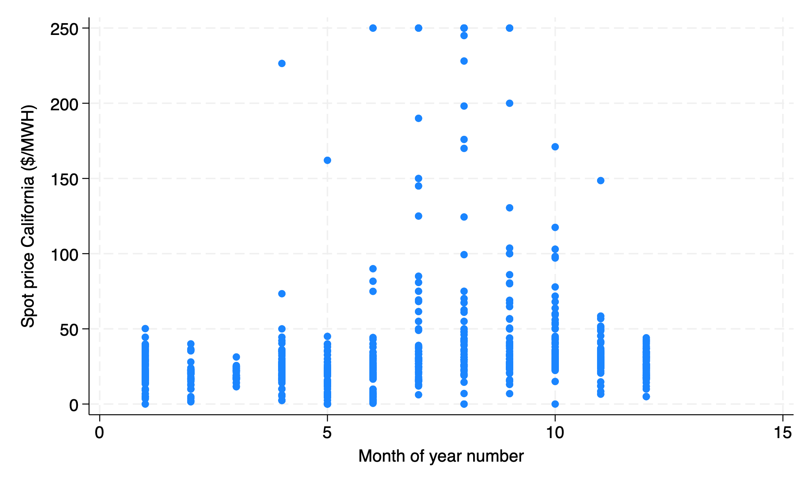
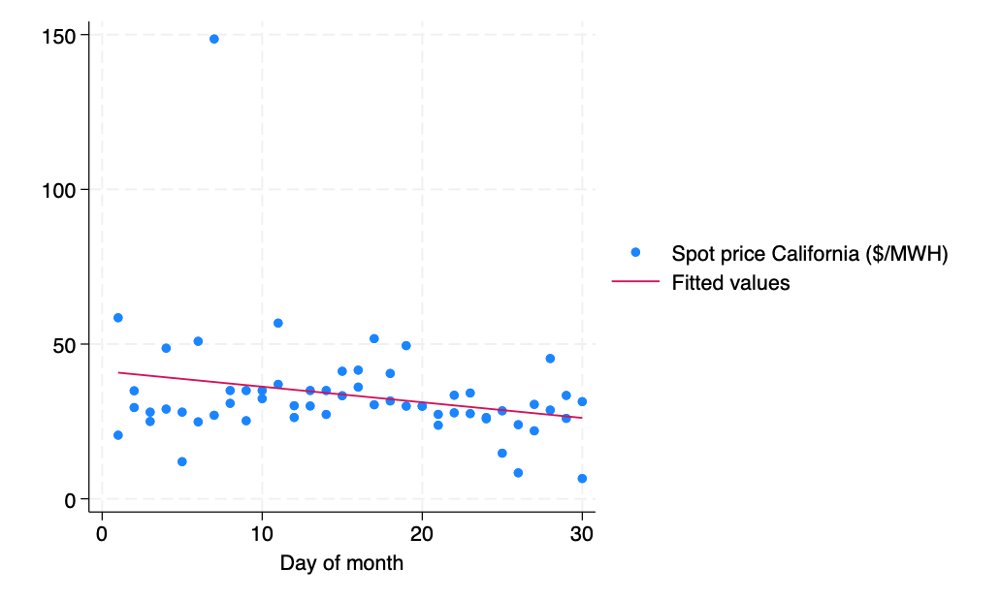

```{r}
#| label: setup
#| include: false
require("Statamarkdown")
```

## Question 1: Bivariate model assumptions

a) What is the first population assumption of bivariate OLS regression? How might this assumption be violated? How could we account for this violation?

**Linearity: the true relationship between x and y is linear. This could be violated if we instead have a true nonlinear relationship, which we could account for by adapting our regression to match.**

b) What is the second population assumption of bivariate OLS regression? How might this assumption be violated? How could we account for this violation?

**Unbiasedness: the conditional expected value of our error term is zero for all values of x. This could be violated if there are variables missing from our regression that are correlated with x and y. We could address this by including these missing/omitted regressors in a multivariate regression.**

c) What is the third population assumption of bivariate OLS regression? How might this assumption be violated? How could we account for this violation?

**Homoskedasticity: the distribution (variance) of our errors is constant across values of x. This could be violated if the distribution of our errors changes for larger or smaller values of x. We could account for this by using robust standard errors in our regression.**

d) What is the fourth population assumption of bivariate OLS regression? How might this assumption be violated? How could we account for this violation?

**Independence: our error terms are uncorrelated for different units of observation. This could be violated if our observations are not independent from each other, such as time-series data of GDP for a given country. We could account for this by using more complicated forms of regression that account for error dependence.**

## Question 2: Manual calculations

Consider a dataset with 3 observations for $(x,y): (2,4),(1,3)$ and $(6,2)$.

From first principles (using formulas **not Stata**), compute:

a) the OLS intercept

::: {.content-visible when-format="pdf"}
```{=latex}
\resizebox{\textwidth}{!}{%
\begin{tabular}{ccccccccc}
\hline
$x_i$ & $y_i$ & $\bar{x}$ & $\bar{y}$ & $(x_i-\bar{x})$ & $(x_i-\bar{x})^2$ & $(y_i-\bar{y})$ & $(y_i-\bar{y})^2$ & $(x_i-\bar{x})(y_i-\bar{y})$ \\
\hline
2 & 4 & 3 & 3 & $-1$ & 1 & 1 & 1 & $-1$ \\
1 & 3 & 3 & 3 & $-2$ & 4 & 0 & 0 & 0 \\
6 & 2 & 3 & 3 & 3 & 9 & $-1$ & 1 & $-3$ \\
\hline
\end{tabular}}
```
:::

::: {.content-visible unless-format="pdf"}
| $x_i$ | $y_i$ | $\bar{x}$ | $\bar{y}$ | $(x_i-\bar{x})$ | $(x_i-\bar{x})^2$ | $(y_i-\bar{y})$ | $(y_i-\bar{y})^2$ | $(x_i-\bar{x})(y_i-\bar{y})$ |
|---|---|---|---|---|---|---|---|---|
| 2 | 4 | 3 | 3 | −1 | 1 | 1 | 1 | −1 |
| 1 | 3 | 3 | 3 | −2 | 4 | 0 | 0 | 0 |
| 6 | 2 | 3 | 3 | 3 | 9 | −1 | 1 | −3 |
:::

$$b_1=\bar{y}-b_2\bar{x}=3-\left(-\frac{4}{14}\right)\times3=\boldsymbol{3.86}$$

b) the OLS slope coefficient

$$b_2=\frac{\sum_i(x-\bar{x})(y-\bar{y})}{\sum_i(x-\bar{x})^2}=\frac{-1+0-3}{1+4+9}=-\frac{4}{14}=\boldsymbol{-0.29}$$

c) residuals for the three observations

$$e_i=y_i-\hat{y}_i:$$

$$\begin{aligned}
4-[3.86-0.29\times2] &= 4-3.28 = \boldsymbol{0.72} \\
3-[3.86-0.29\times1] &= 3-3.57 = \boldsymbol{-0.57} \\
2-[3.86-0.29\times6] &= 2-2.12 = \boldsymbol{-0.12}
\end{aligned}$$

$$\sum_i e^2_i = 0.86$$

d) the $R^2$ of `reg y x` (or `reg x y`)

$$R^2=1-\frac{\sum_i e_i^2}{\sum_i(y_i-\bar{y})^2}=1-\frac{0.86}{2} = \boldsymbol{0.57}$$

e) the covariance of X and Y

$$Cov(x,y)=\frac{\sum_i(x_i-\bar{x})(y_i-\bar{y})}{n-1} = \frac{-1 + 0 - 3}{2} = \boldsymbol{-2}$$

f) the correlation between X and Y

$$r_{xy} = \frac{Cov(x,y)}{s_xs_y} = \frac{-4}{\sqrt{14}\sqrt{2}} = \boldsymbol{-0.76}$$

## Question 3: Bivariate regression

Use AED_SALARYSAT.DTA.

a) What variables are present in our dataset? List them along with their labels.

```{stata}
#| label: salarysat-describe
#| collectcode: true
u AED_SALARYSAT
des
```

b) Suppose we want to run a regression of salary on SAT verbal score. Perform this regression and interpret the output.

```{stata}
#| label: salary-regression
#| collectcode: true
reg salary satverb
```

$\boldsymbol{\widehat{salary}=23752.62+23.93\times SATverb}$. **Variation in SAT verbal score accounts for 1.09% of variation in salary.**

c) Generate the residuals from the above regression using `predict resid, resid` and plot these against SAT verbal scores in a scatter plot. Do our errors appear to be homoskedastic or heteroskedastic?

```{stata}
#| label: residual-plot
predict resid, resid
sc resid satverb
qui gr export residplot.png, replace
```

{fig-alt="Scatter plot of regression residuals on the y-axis versus SAT verbal score on the x-axis. The spread of residuals increases for higher verbal scores, indicating heteroskedasticity."}

**Our errors appear to be a bit heteroskedastic, with larger errors for larger values of SAT verbal score.**

d) Make changes to the regression in part (b) to account for your answer in part (c). How does this change your estimated coefficients? How does this change your estimated standard errors? Does this make sense?

```{stata}
#| label: salary-robust
reg salary satverb, robust
```

**We would want to add the `, robust` option to our regression to account for this heteroskedasticity. This should change our standard errors but not our point estimates for our coefficients. In this case, robust standard errors decrease our standard error and increase our t-score for our slope coefficient.**

## Question 4: Bivariate regression

Using AED_CALELECTRICITY.DTA from hw2, we now want to investigate when electricity gets more and less expensive.

a) Create a scatterplot of the spot price of electricity and the month. What do you notice?

```{stata}
#| label: electricity-scatter-month
#| collectcode: true
u AED_CALELECTRICITY
sc niso month
qui gr export q2scatter.png, replace
```

{fig-alt="Scatter plot of spot price of electricity on the y-axis versus month on the x-axis. Prices are higher and more variable during summer months (June through August)."}

**We notice that the spot price of electricity is higher and more varied during the summer months.**

b) Create a scatterplot of the spot price and the day *only for the month of November*. What do you notice?

```{stata}
#| label: electricity-scatter-day-nov
sc niso day if month==11
```

**We notice that there is an outlier value of around \$150 for the spot price on one day, and that otherwise the spot price is relatively consistent.**

c) Overlay a best fit line onto your scatterplot from part (b). Without calculations or running a regression, what would you expect $b_1$ and $b_2$ to be for a regression of day on spot price in the month of November?

```{stata}
#| label: electricity-scatter-lfit
sc niso day if month==11 || lfit niso day if month==11
qui gr export q2scatterNOV.png, replace
```

{fig-alt="Scatter plot of spot price of electricity on the y-axis versus day of month in November on the x-axis, with a best fit line overlaid showing a negative slope. One outlier appears near $150."}

**We would expect a $b_1\approx40,b_2<0$ given what we see from the best fit line.**

d) Between *day* and *month*, which series is more correlated with the spot price?

```{stata}
#| label: electricity-correlation
corr niso month day
```

**_Month_ is more correlated with _niso_ than _day_ (0.1685 vs. 0.0345).**

e) Perform the regression from part (b) of the spot price on day during November. Interpret your results.

```{stata}
#| label: electricity-regression-nov
reg niso day if month==11
```

**We see that indeed our intercept term is near 40 and our slope is negative — electricity prices decrease throughout November.**

f) Suppose we are concerned our data violates the third assumption of bivariate linear regression. What could we add to part (e) to address this? Make this change and interpret your new results.

**If we are worried that our data violates homoskedasticity, we can add the `, robust` option to our regression to accommodate heteroskedastic errors.**

```{stata}
#| label: electricity-regression-robust
#| collectcode: true
reg niso day if month==11, robust
```

g) What would we expect the spot price of electricity to be on the first day of November? On the last?

$\boldsymbol{41.28-0.50\times1=\$40.78}$

$\boldsymbol{41.28-0.50\times30=\$26.28}$

h) Find a day of the month in November with a positive residual. Find a day of the month in November with a negative residual.

```{stata}
#| label: electricity-residuals
predict residual if month==11, resid
list day residual if month==11
```

i) Interpret the t-stat, p-value, and confidence interval for $b_2$ in your regression from part (f). What test does this correspond to? What are its hypotheses? What is its conclusion and why?

**This is our test of association between *day* and *niso*.** $$H_0:\beta_2=0;\quad H_A:\beta_2\neq0$$ **With $\alpha=0.05$, we fail to reject the test of association as our p-value is 0.076>0.05. We can also confirm this conclusion with our critical value approach or our confidence interval including 0.**
