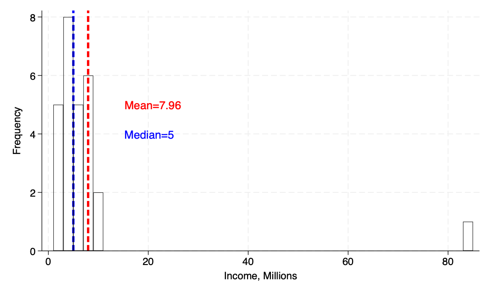
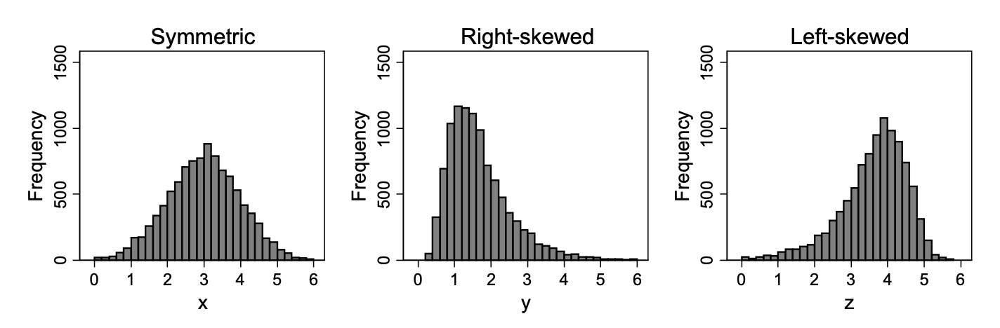
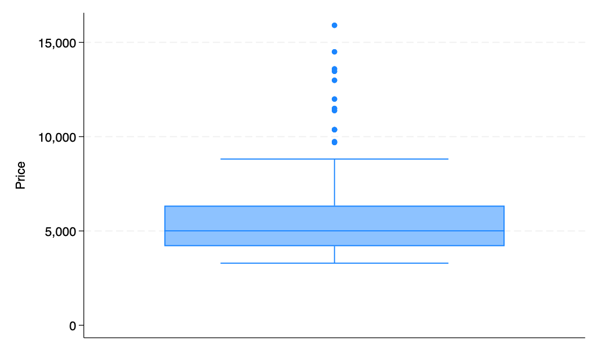
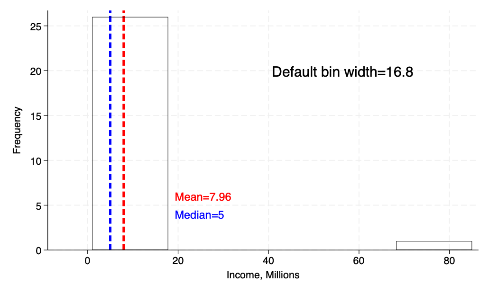
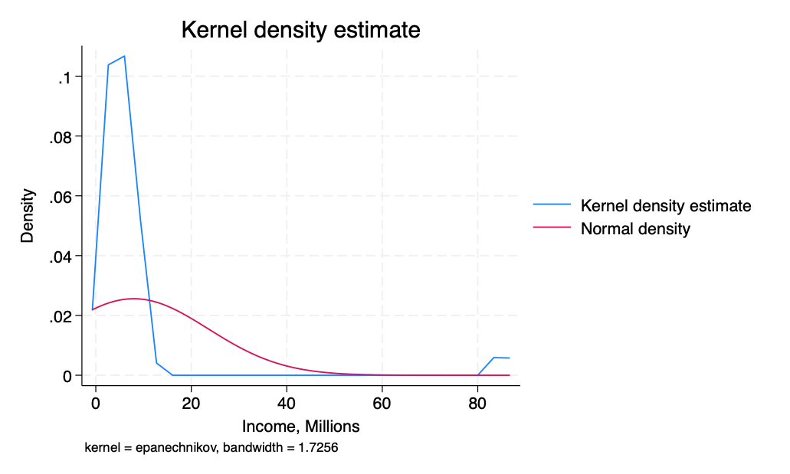
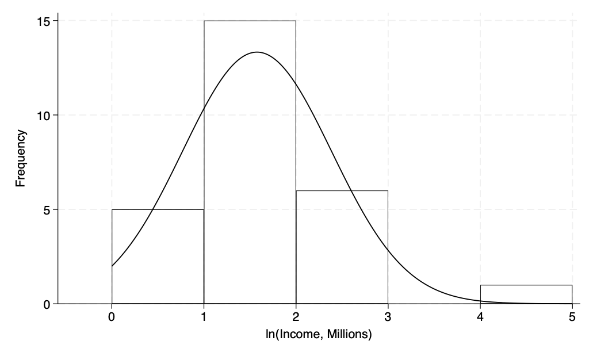

```{r}
#| label: setup
#| include: false
require("Statamarkdown")
```

# Summary Statistics

## Overview

We will start our discussion of *univariate* data with *summary* or *descriptive statistics*:

- Population size: $N$ (big)

- Sample size: $n$ (little)

- Measures of *central tendency*: where is the data centered?

- Measures of *spread*: how squished or spread out is the data?

As before, we denote cross-sectional data $x_i$, where $i$ is the index of the observation. What would $x_1$ be? $x_{n-1}$? $x_n$?

## Central Tendency: Mean

Central tendency: **sample mean** (arithmetic mean)

$$\bar{x} = \frac{x_1+x_2+...+x_n}{n}$$

$$\bar{x} = \frac1n \sum_{i=1}^n x_i$$

. . .

**Population mean**

$$\mu = \frac1N\sum_{i=1}^N x_i$$

## Percentiles and Quartiles

We can divide our data into **quartiles**, **deciles**, **percentiles**, and more. The name indicates how many pieces we cut our data into:

- **quart**ile: data is divided into 4 pieces

- **dec**ile: data is divided into 10 pieces

- **percent**ile: data is divided into 100 pieces

We often talk about the *upper* or *lower* quartile, the value that contains 25% of the data below or above it. We denote these $p^{75}$ and $p^{25}$. We give the middle quartile (or 50^th^ percentile) a special name.

## Central Tendency: Median

Central tendency: **sample median**

$\Rightarrow$ The median is the 50th percentile of ordered data, or the value 50% of my data is above and 50% is below. Its formula depends on whether $n$ is odd or even:

Odd: $$Median=x_{(n+1)/2}$$

Even: $$Median=\frac{x_{(n/2)+1}+x_{n/2}}{2}$$

Note we need to **order** our data from small to large to apply this formula for the median.

## Median vs. Mean: Outlier Robustness

The *sample median* will be less affected by *outliers* than the *sample mean*, as it only considers at most two central observations instead of all observations.

We use the median in cases where the data is likely to be very left- or right-*skewed* by *outliers*, such as a sample of annual income that includes someone like Bill Gates.

## Example: Mean vs. Median

```{stata}
#| label: graphs
#| results: false
#| collectcode: true

sysuse auto
gr box price
gr export L2box.png, replace
clear

input income
4
5
3
2
6
8
5
3
2
4
6
8
85
1
3
7
8
4
2
4
2
5
10
9
8
7
4
end

la var income "Income, Millions"

qui su income, d
local mean = string(`r(mean)', "%3.2f")

hist income, fcolor(none) lcolor(black) w(2) freq ///
	xline(`r(mean)', lcolor(red) lwidth(thick)) ///
	xline(`r(p50)', lcolor(blue) lwidth(thick)) ///
	text(5 15 "Mean=`mean'", place(e) size(medium) color(red)) ///
	text(4 15 "Median=`r(p50)'", place(e) size(medium) color(blue))

gr export L2_hist.png, replace

qui su income, format d
local mean = string(`r(mean)', "%3.2f")

hist income, fcolor(none) lcolor(black) freq ///
	xline(`r(mean)', lcolor(red) lwidth(thick)) ///
	xline(`r(p50)', lcolor(blue) lwidth(thick)) ///
	text(6 19 "Mean=`mean'", place(e) size(medium) color(red)) ///
	text(4 19 "Median=`r(p50)'", place(e) size(medium) color(blue)) ///
	text(20 40 "Default bin width=16.8", place(e) size(large) color(black))

gr export "L2 bad hist.png", replace

kdensity income, normal
gr export "L2Kernel.png", replace

g lincome = ln(income)
la var lincome "ln(Income, Millions)"
qui su lincome, d
local mean = string(`r(mean)', "%3.2f")

hist lincome, fcolor(none) lcolor(black) w(1) freq  normal
gr export L2_log.png, replace
```

{width=100% fig-alt="Histogram of simulated income data. The distribution is heavily right-skewed due to a large outlier near 85. A red vertical line marks the mean and a blue vertical line marks the median, illustrating that the mean lies to the right of the median in right-skewed data."}

## Central Tendency: Mode

Central tendency: **mode**

- The mode is the most represented value in the data. Data can be multi-modal, where multiple values are equally represented most often in the data.

- We may want to invoke the mode when data is discrete or continuous but highly rounded.

## Spread: Range and IQR

Spread: **range** and **interquartile range (IQR)**

- Range is hopefully familiar, $\max\{x_i\}-\min\{x_i\}$

- IQR is the difference between 75^th^ and 25^th^ percentiles, $p^{75}-p^{25}$. The IQR captures the middle 50% of our data.

## Spread: Sample Variance and Std Dev

Spread: **sample variance**

- Sample variance is the sum of *squared deviations* in our data, $(x_i-\bar{x})^2$. We cannot simply use $x_i-\bar{x}$, as this will *always sum to zero*. We denote this: $$s^2=\frac{1}{n-1}\sum_{i=1}^n (x_i-\bar{x})^2$$

- To return our measure of spread to the units of our original data, we take the square root and obtain the **sample standard deviation**: $$s=\sqrt{s^2} = \sqrt{\frac{1}{n-1}\sum_{i=1}^n (x_i-\bar{x})^2}$$

## Spread: Population Variance and Std Dev

Spread: **population variance, std dev**

$\Rightarrow$ Like before, we can also compute population parameters for spread if we know our entire population. However, this will require a slight change to the formula, which we will explore later.

$$\sigma=\sqrt{\sigma^2}=\sqrt{\frac1N\sum_{i=1}^N(x_i-\mu)^2}$$

Generally, a standard deviation tells us how far away an average observation is from the mean.

## Review: Sample Statistics and Parameters

To review, we have two main sample statistics ($\bar{x},s^2$) and two main population parameters ($\mu,\sigma^2$) to measure central tendency and spread, respectively. Generally, we give the mean and *variance* in parentheses for a given variable — remember to take the square root for standard deviation!

## Spread: Coefficient of Variation

However, simply having higher standard deviation does not necessarily mean a variable has more variability relative to its mean or **dispersion** — its units could simply be larger.

For example, $x=(5,64); y = (1,25)$. Does $x$ or $y$ have a higher level of dispersion?

. . .

$\Rightarrow$ To answer this, we must introduce the **coefficient of variation (CV)**, which weights our measure of spread by our measure of central tendency: $$CV=\frac{s}{\bar{x}}$$

Since $\frac51>\frac85$, $y$ has a higher level of dispersion, *despite having a lower standard deviation*.

## Skewness

We also have more complicated summary statistics for our data:

- **Symmetry** of our data means it can be perfectly reflected around the median ($p^{50}$)

- Data that has a tail to the right is **right-** or **positive-skewed**

- Data that has a tail to the left is **left-** or **negative-skewed**

{width=100% fig-alt="Three distribution curves labeled left-skewed, symmetric, and right-skewed. The left-skewed curve has a long tail extending to the left. The symmetric curve is bell-shaped with equal tails. The right-skewed curve has a long tail extending to the right."}

## Measuring Skewness

We say our data is:

- right-skewed if it has a *skewness* $>0$

- left-skewed if its *skewness* $<0$

- symmetric if its *skewness* $=0$

## Skewness: Mean vs. Median

We can also use the comparison between our computed mean and median to impute skewness. What does it mean to have:

- $\bar{x}>median$?

- $\bar{x}<median$?

- $\bar{x}=median$?

## Kurtosis

We will consider one more measure of our data, **kurtosis**. This is a measure of how fat the tails of our data are; how represented values far away from the mean are.

- We define a **normal distribution** as one with symmetry/zero skewness (median=mean) and a kurtosis of exactly 3

- Distributions with a kurtosis $>3$ have fatter tails than the normal, and those with kurtosis $<3$ have thinner tails

## Kurtosis: Graphical Representation

Kurtosis graphical representation:

## Putting It Together

Together, *central tendency, spread, skewness,* and *kurtosis* characterize datasets we will work with. Understanding how our dataset compares to a normal distribution will be important for the statistical inference we will conduct.

# Data Visualization

## Overview

We will now move to standard ways to visualize data we have collected. This often comes in the form of plots or summary tables. You will be asked to replicate many of these for example data in Stata for homework.

## Summary Statistics Table

A *summary statistics* table gives the statistics we have discussed above for a given sample of data:

```{stata}
#| label: summarize
#| collectcode: true
sysuse auto, clear
su price, d
```

## Box-and-Whisker Plot

A **box[-and-whisker] plot** gives the median, IQR, (skewness,) and any outliers for a given variable:

{width=100% fig-alt="Box-and-whisker plot of automobile prices. The box spans the interquartile range with a line at the median. Whiskers extend to the adjacent values, and several high-priced outliers appear as individual points above the upper whisker, indicating right skew."}

## Frequency Table

A **frequency table** gives statistics for each value of a variable:

- **Frequency** is how often a given value of a variable is represented in our data

- **Relative frequency** (or percent) is this quantity scaled by the total frequency of all values

- **Cumulative percent** is the proportion of total values made up by the given value and all previous/lower values

## Frequency Table: Example

```{stata}
#| label: freq
tab foreign
```

## Histogram

A **histogram** plots frequency of data values organized into **bins**. As a researcher, it is often up to you to determine the optimal *bin width* for the data you are presenting. (Common default $\sqrt{n}$)

{width=100% fig-alt="Histogram of income data using Stata's default bin width of 16.8, resulting in only a few wide bars that obscure the shape of the distribution. Mean and median lines are overlaid in red and blue respectively. A text label notes the default bin width."}

## Kernel Density Plot

A **kernel density** plot is a smoothed version of the histogram that uses **windows** instead of bins.^[The weights given to values within a window are called **kernel weights**.]

{width=100% fig-alt="Kernel density plot of income data shown as a smooth curve, with a normal distribution overlaid for comparison. The income distribution is right-skewed relative to the symmetric normal curve."}

## Bar Charts and Pie Charts

Some additional charts:

- **Bar charts** plot values for discrete categories instead of continuous bins or windows

- **Pie charts** give each value as a relative frequency of a total

# Data Transformations

## Log Transformation

Sometimes we may need to apply a transformation to our data to have it appear more symmetric. One such transformation for right-skewed data is often the **natural logarithm**, which can reduce large outlying (right) values.

$\Rightarrow$ Data that appears normal once log-transformed is said to follow a *lognormal* distribution.

## Log Transformation: Example

{width=100% fig-alt="Histogram of log income values with a normal distribution curve overlaid. The log-transformed distribution appears approximately symmetric and close to normal, contrasting with the right-skewed untransformed income data."}

## Standardization and Z-Scores

We may also want to **standardize** our data and transform it into a **z-score**. To do this, we subtract the population mean and divide by the population standard deviation: $$z_i=\frac{x_i-\mu}{\sigma}$$

Note: z-scores will always have $(0,1)$ as a result but *will not magically become normally distributed*. A non-normal standardized variable will remain non-normal even as $n\rightarrow\infty$. A distribution that *is* normal will remain normal after standardizing.

## Interpreting Z-Scores

Standardized [z-]scores allow us to compare values from series that are scaled differently, such as two different exams with different means and standard deviations. A 1-unit change in a standardized variable will always correspond to $\pm\sigma$ for that series.

If you scored an 80 on an exam with $(65,100)$ and a 62 on an exam with $(50,36)$, on which exam did you perform better *relative to the average*?

## Growth Rates

It may be more interesting to analyze the *growth rates* of a variable than the variable itself (or even, growth rates of growth rates, e.g. inflation). To compute a growth rate for a variable $x_t$: $$\%\Delta x_t=100\times\frac{x_t-x_{t-1}}{x_{t-1}}\text{ or }100\times\left(\frac{x_t}{x_{t-1}}-1\right)$$

We may need to *annualize* this data if it does not come from a year-frequency series already. For quarterly data, this would mean multiplying the growth rate by 4.

# End of Lecture Material

## Knowledge Check 2

Suppose we compute $\bar{x}=2.5, Median=1.5$ for a sample of data:

- Without using formulas, is this data symmetric or skewed? Is it normally distributed?

- Would you expect the z-scores for these observations to be normally distributed? Why or why not?
