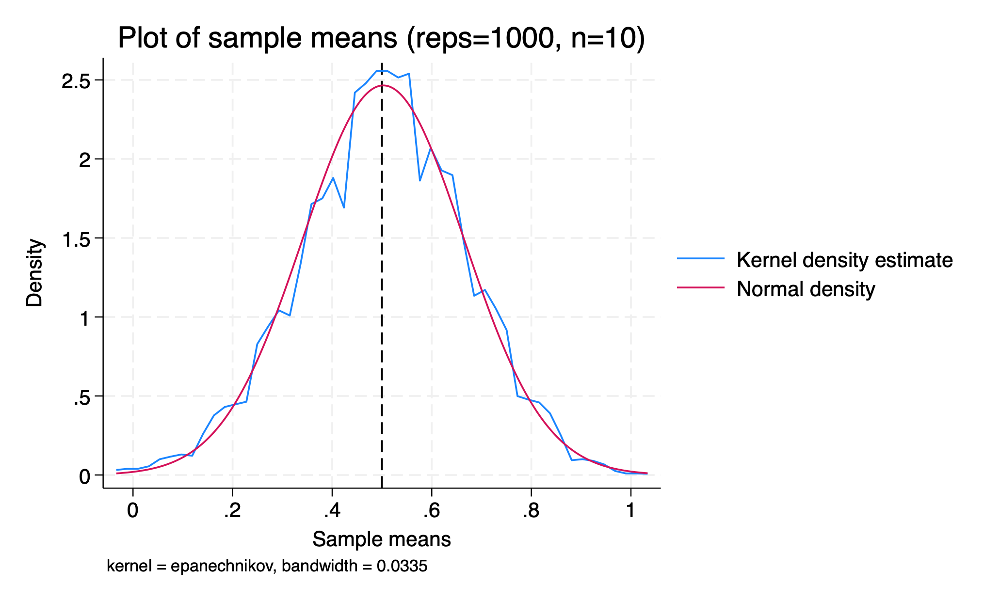
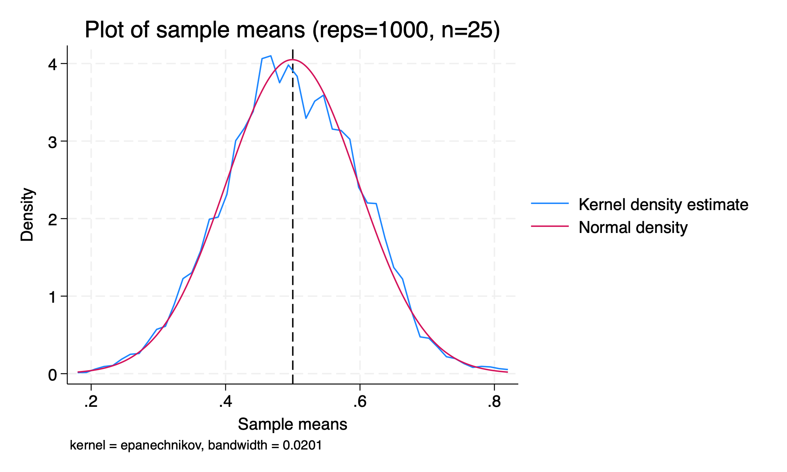
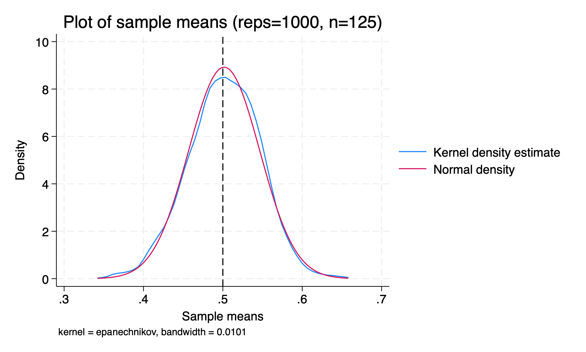

```{r}
#| label: setup
#| include: false
require("Statamarkdown")
```

# Random Variables

## Overview

We previously discussed the sample mean, $\bar{x}$, but different samples of data may give us different sample means due to randomness in the data. How can we use the sample mean to say something substantive about the larger population?

## Defining Random Variables

We call a variable a **random variable** (r.v.) if its outcome will be determined by some uncertain, *probabilistic*, or *stochastic* process.

A random variable $X$ (big) could be whether a flipped coin lands heads or tails; $x$ (little) is each potential outcome value $X$ could take. For the coin, $$X=\begin{cases}
X=H & \Pr(X=H) = 0.5 \\
X=T & \Pr(X=T) = 0.5
\end{cases}$$

We say $\Pr(X=x)$ for the chance our r.v. $X$ takes value $x$.

## Expected Value

We can summarize a random variable just like any other variable, to say something about its central tendency and spread. For a *probabilistic* r.v., its **expected value** is the probability-weighted average of all possible values $x$ our variable $X$ may take.

This expected value will be the *population mean* of our r.v. For a *discrete* r.v., we compute expected value using a sum^[For a *continuous* r.v., we would use an integral to compute expected value.]: $$\mu\equiv E[X] = \sum_x x\cdot\Pr(X=x)$$

As with all probabilistic outcome spaces, we must ensure that *our probabilities for all possible values of $X$ sum to 1*.

## Variance and Standard Deviation

We can also compute a measure of spread for a r.v., the expected value of squared deviations from our population mean. We denote this variance $$\sigma^2=E[(X-\mu)^2]$$ and standard deviation $$\sigma=\sqrt{\sigma^2} = \sqrt{E[(X-\mu)^2]}$$

To compute this, we again use the probability $\Pr(X=x)$ for each value of $X$: $$\sigma^2=\sum_x (x-\mu)^2\cdot\Pr(X=x)$$ To do this, we first need to compute $\mu$.

## Example: Computing Mean and Variance

An example: Given an $X$: $$X=\begin{cases}
0 & 0.1 \\
2 & 0.5 \\
3 & 0.3 \\
4 & 0.1
\end{cases}$$ we could compute $\mu$, $\sigma^2$, and $\sigma$. What is this r.v. $X$ in words?

. . . 

X is a r.v. that takes value 0 with 10% chance, 2 with 50% chance, 3 with 30% chance, and 4 with 10% chance.

## Properties of Expectation and Variance

We have some properties that help us evaluate the mean and variance of a r.v. $X$ transformed with $a + bX$.

- $E[a+bX]=a + b\times E[X]$

- $Var[a+bX]=b^2\times Var[X]$

- $Var[X+Y]=Var[X]+Var[Y]$ if $X$ and $Y$ are independent

As we can see, adding or subtracting a constant $a$ from a r.v. changes its measure of central tendency *but not its measure of spread*, while multiplying a r.v. by a constant $b$ changes *both* measures. We will need these properties later for our proofs.

# Random Samples

## From Sample to Sample Mean

If we have a r.v. $X$, we can take a random *sample* of that variable of size $n$. This will contain $n$ *realizations* of our r.v. $X$, and any summary statistics we compute for this sample will themselves be random variables.

We previously computed $\bar{x}$, the sample mean for a *given* sample of $X$. However, we could have drawn a different sample and computed a different sample mean, so our sample mean itself is a r.v. $\bar{X}$. $\bar{x}$ is a realization of $\bar{X}$.

## Sample Variance as a Random Variable

Similarly, the variance (or standard deviation) we computed for our sample, $s^2$, is also dependent on the random sample of $X$ we draw. Like the sample mean $\bar{x}$, each $s^2$ we compute from our data is a realization of the r.v. for the sample variance, $S^2$.

When we compute $s^2$, we cannot do so directly. First, we must compute $\bar{x}$ from our data and then include that computed statistic in our formula $s^2=\frac{1}{n-1}\sum_{i=1}^n(x_i-\boldsymbol{\bar{x}})^2$. Since we use **one** statistic already computed from our data in the formula for $s^2$, we must subtract **one** **degree of freedom** from our number of observations: $$s^2=\frac{1}{\boldsymbol{n-1}}\sum_{i=1}^n(x_i-\bar{x})^2$$

## Distribution of Sample Means

Our r.v. $X$ may not be (and often is not) *normally distributed*. However, something quite magical happens to the distribution of *sample means* when our sample is big enough.

Note: we are not talking about the individual realizations of $X$ in each sample, but instead the measure of central tendency $\bar{x}$ for each sample.

Let's simulate 1000 draws of increasingly large samples of fair coin tosses, with a 50% chance of heads or tails.

## Stata: Simulating Coin Toss Sample Means {shrink=20}

A peak under the hood of our simulation:

```{stata}
#| label: coin-toss
#| results: false
#| echo: true
clear
set seed 1234
cap pr drop nsim
pr def nsim, rclass
	syntax [, obs(int 1)]
	drop _all
	set obs `obs'
	tempvar z
	g `z' = runiformint(0,1) // fair coin toss
	qui su `z'
	ret sca mean = `r(mean)'
end

foreach i of numlist 10 25 125 {
	qui simulate mean=r(mean), reps(1000): nsim, obs(`i')
	la var mean "Sample means"
	kdensity mean, normal xline(0.5) ///
	title("Plot of sample means (reps=1000, n=`i')")
	gr export L3_n`i'.png, replace
}
```

## Sample Means with n = 10

{width=100% fig-alt="Kernel density plot of 1000 sample means drawn from fair coin tosses with sample size n=10, with a vertical reference line at 0.5 and a normal distribution overlaid for comparison. The distribution of sample means is roughly bell-shaped but relatively wide and irregular, reflecting high variance at this small sample size."}

## Sample Means with n = 25

{width=100% fig-alt="Kernel density plot of 1000 sample means drawn from fair coin tosses with sample size n=25, with a vertical reference line at 0.5 and a normal distribution overlaid for comparison. The distribution of sample means is noticeably closer to normal and narrower than in the n=10 case, reflecting reduced variance with the larger sample size."}

## Sample Means with n = 125

{width=100% fig-alt="Kernel density plot of 1000 sample means drawn from fair coin tosses with sample size n=125, with a vertical reference line at 0.5 and a normal distribution overlaid for comparison. The distribution of sample means very closely follows the overlaid normal curve, illustrating the central limit theorem as sample size increases."}

## Central Limit Theorem: Intuition

What is happening?

$\Rightarrow$ Our distribution of *sample means* is looking more and more normal as we simulate larger samples of random coin tosses. Our coin toss r.v. is definitely not normally distributed, but the distribution of its sample means appears to be as $n\rightarrow\infty$.

Note: $n$ here refers to the **sample size** (10, 25, 125), NOT the number of repetitions (always 1000).

$\Rightarrow$ In addition, the average of our sample means ($\mu_{\bar{X}}$) appears to be roughly equal to the average of our coin toss r.v., $\mu=0.5$^[$\mu\equiv\sum_x x\cdot\Pr(X=x)=1\cdot0.5+0\cdot0.5=0.5$].

## Assumptions: Simple Random Samples

Let us place some formal structure on our discussion of our r.v. $X$:

A) $X_i$ has a common mean $\mu:E[X_i]=\mu$ for all $i$

B) $X_i$ has a common variance $\sigma^2:Var[X_i]=\sigma^2$ for all $i$

C) Different realizations of $X$ do not influence each other; $X_i$ is statistically independent of $X_j$ for all $i\neq j$

Together, these imply that $X\sim(\mu,\sigma^2)$, where $\sim$ is read as "is distributed with"; *X is a random variable distributed with population mean $\mu$ and population variance $\sigma^2$.* We call samples with these properties **(simple) random samples**.

## Mean of the Sample Mean

The **population mean of the sample mean** $\bar{X}$ is: $$\mu_{\bar{X}}\equiv E[\bar{X}] = \mu$$ Proof:

. . . 

$$\mu_{\bar{X}} = E[\bar{X}] = E\left[\frac{1}{n}\sum_{i=1}^n X_i\right] = \frac{1}{n}\sum_{i=1}^n E[X_i] = \frac{1}{n}\sum_{i=1}^n \mu = \frac{n\mu}{n} = \mu$$

## Variance of the Sample Mean

The **population variance of the sample mean** $\bar{X}$ is: $$\sigma^2_{\bar{X}}=Var[\bar{X}] \equiv E[(\bar{X}-\mu_{\bar{X}})^2]=\frac{\sigma^2}{n}$$

Proof:

. . . 

$$\begin{aligned}
\sigma^2_{\bar{X}} &= \text{Var}[\bar{X}] = \text{Var}\left[\frac{1}{n}\sum_{i=1}^n X_i\right] \\
&= \frac{1}{n^2}\sum_{i=1}^n \text{Var}[X_i] = \frac{1}{n^2}\sum_{i=1}^n \sigma^2 = \frac{n\sigma^2}{n^2} = \frac{\sigma^2}{n}
\end{aligned}$$

## Standard Deviation of the Sample Mean

Thus, the **standard deviation of the sample mean** is given by: $$\sigma_{\bar{X}}\equiv\sqrt{\frac{\sigma^2}{n}}=\frac{\sigma}{\sqrt{n}}$$

This quantity represents the *spread of our sample means* for a given sample size $n$, our *precision* in estimating our sample mean.

We can see that *larger samples mechanically lead to greater precision in estimating $\mu$*: $\sigma_{\bar{X}}\rightarrow0$ as $n\rightarrow\infty$.

## Characterizing the Sample Mean

So far, we have shown that $\bar{X}\sim(\mu,\frac{\sigma^2}{n})$ or that:

*"X-bar is a random variable distributed with population mean $\mu$ and population variance $\sigma^2/n$".*

. . .

We need one more result to complete our characterization of $\bar{X}$.

## The Central Limit Theorem

Using the **central limit theorem**, we can say that $\bar{X}$ will be *approximately normally distributed* whenever $n>30$. Note, this is the sample size, *not the number of resamplings we do*.

With the CLT, we now have that $\bar{X}\sim N(\mu,\frac{\sigma^2}{n})$.

We say that $\bar{X}$ is **asymptotically normally distributed** since its distribution becomes normal as $n\rightarrow\infty$.

## Standardizing the Sample Mean

Finally, we can *standardize* $\bar{X}$ to turn it into a z-score. Since $\bar{X}$ is normally distributed by the CLT when $n>30$, this will be a standard *normal* distribution.

$$Z=\frac{\bar{X}-\mu}{\sigma/\sqrt{n}}\sim N(0,1)$$

- "Standard" means we have mean 0 and variance 1

- "Normal" means our distribution is perfectly symmetric (skew=0) and has kurtosis of exactly 3

- The standard normal distribution is well-understood, making it easy to conduct statistical tests

## Estimating Population Variance

For a given sample, however, we are unlikely to know our population variance $\sigma^2$ from a single sample. Instead, we can replace $\sigma^2$ with $s^2$, the sample estimate of variance.

This is given by: $$s_{\bar{X}}^2=\frac{s^2}{n} = \frac{\frac{1}{n-1}\sum_i(x_i-\bar{x})^2}{n}$$

## The Standard Error

Similarly, we can take $$s_{\bar{X}}=\frac{\sqrt{s^2}}{\sqrt{n}} = \frac{\sqrt{\frac{1}{n-1}\sum_i(x_i-\bar{x})^2}}{\sqrt{n}}$$

Since this is no longer the standard deviation of the sample mean, we give this quantity a new name: the **standard error** of $\bar{X}$. We are able to calculate this quantity using only *sample statistics* from our given dataset (no $\mu$ or $\sigma^2$ here).

## Revisiting the Assumptions

All of the above identities rely on the three previous assumptions:

1. Common mean

2. Common variance

3. Independence of observations

Later, we will relax these assumptions.

## Sample Representativeness and Weights

So far, we have implicitly assumed that our samples are **representative** of our population — they are simple random samples. However, we may encounter instances where our sample is not representative of the broader population. In these cases, sample statistics derived from biased samples will lead to improper estimations of population parameters.

. . .

$\Rightarrow$ What can be done? One common solution is to use **sample weights**, quantities to increase or decrease how represented a given value is in a sample when estimating a population. For example, we could weight all observations in the sample by some probability $p$ that such a value appears in the sample.

# Estimators

## What Is an Estimator?

In the cases above, we have been *estimating* the population mean $\mu$ with the sample mean $\bar{X}$, as we do not know the true value of the former (We also estimated $\sigma$ with $s$). We want to think about properties of a good estimator that will lead us to a proper conjecture about the true (unknown) population parameter.

## Unbiasedness

One such property is **unbiasedness**: the expected value of an estimator is equal to the population parameter.

We have shown that $\bar{X}$ is an unbiased estimator for $\mu$ since $$E[\bar{X}]=\mu$$

## Visualizing Bias

```{r}
#| label: fig-bias-vs-unbiased
#| fig-cap: 'Sampling distributions of a biased and an unbiased estimator for a population mean $\mu$. The unbiased estimator (solid blue) is centered on $\mu$; the biased estimator (dashed orange) is systematically shifted away from $\mu$.'
#| fig-alt: "A line graph showing two bell-shaped sampling distributions plotted as density curves. A vertical black line marks the true population mean μ. The unbiased estimator, drawn as a solid blue curve, is centered directly on μ. The biased estimator, drawn as a dashed orange curve, has its center shifted to the right of μ, illustrating that it systematically overestimates the true parameter. Both distributions have the same spread, so the only difference between them is the location of their peak."
#| fig-width: 8
#| fig-height: 3.8
#| out-width: 100%
library(ggplot2)
x <- seq(-0.5, 7, length.out = 600)
mu <- 2
df <- data.frame(
  x        = rep(x, 2),
  density  = c(dnorm(x, mean = mu,       sd = 0.8),
               dnorm(x, mean = mu + 1.8, sd = 0.8)),
  Estimator = rep(c("unbiased", "biased"), each = length(x))
)
expr_labels <- c(
  unbiased = expression(paste("Unbiased estimator: centered at ", mu)),
  biased   = expression(paste("Biased estimator: shifted from ", mu))
)
ggplot(df, aes(x = x, y = density, color = Estimator, linetype = Estimator)) +
  geom_line(linewidth = 1.2) +
  geom_vline(xintercept = mu, color = "black", linewidth = 0.8) +
  annotate("text", x = mu - 0.1, y = 0.075,
           label = expression(paste("True ", mu)), hjust = 1, size = 4) +
  scale_color_manual(
    values = c(unbiased = "#0072B2", biased = "#E69F00"),
    labels = expr_labels
  ) +
  scale_linetype_manual(
    values = c(unbiased = "solid", biased = "dashed"),
    labels = expr_labels
  ) +
  guides(
    color    = guide_legend(reverse = TRUE),
    linetype = guide_legend(reverse = TRUE)
  ) +
  labs(x = "Estimator value", y = "Density", color = NULL, linetype = NULL) +
  theme_minimal(base_size = 14) +
  theme(
    legend.position = "bottom",
    panel.grid      = element_blank(),
    axis.line       = element_line(color = "black")
  )
```

## Consistency

Another property is **consistency**: the estimator gets closer and closer to the true parameter value as $n\rightarrow\infty$ and the variance of the estimator shrinks to zero.

We have also shown that $\bar{X}\rightarrow\mu$ and $\frac{\sigma^2}{n}\rightarrow0$ as $n\rightarrow\infty$.

Thus, our estimator $\bar{X}$ for $\mu$ is both *unbiased* and *consistent*.

## Minimum Variance

We may have many unbiased estimators to choose from. A way to further narrow down this list is to designate the **best estimator** as that with the *minimum variance*. We have shown what the population variance is for $\bar{X}$, but we have not shown it to be the minimum variance for all possible estimators of $\mu$.

# End of Lecture Material

## Knowledge Check 3

Suppose $Y\sim(10,25)$ with $\bar{Y}$ as the sample mean for $n=55$.

- Describe in words how $Y$ is distributed.

- What do you expect the mean of $\bar{Y}$ to be?

- What do you expect the variance of $\bar{Y}$ to be?

- How do you expect $\bar{Y}$ to be distributed? Explain.

- Complete the identity $\bar{Y}\sim\_\_(\_\_,\_\_)$
