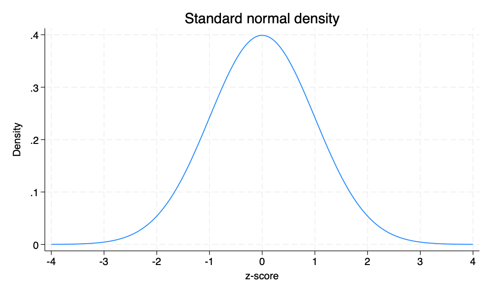
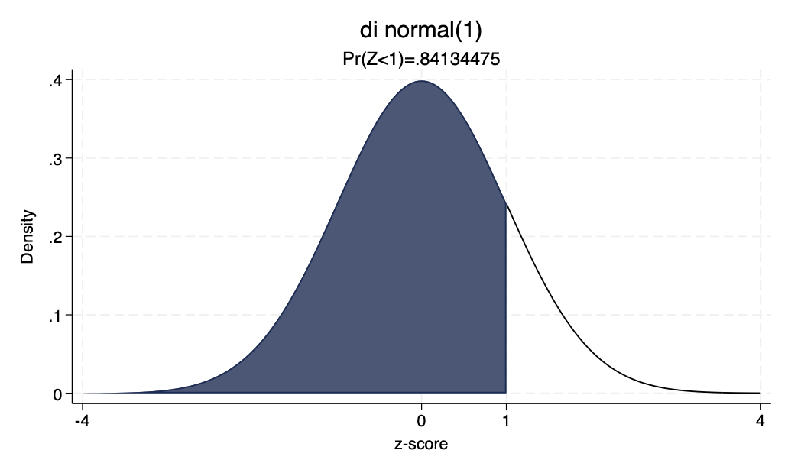
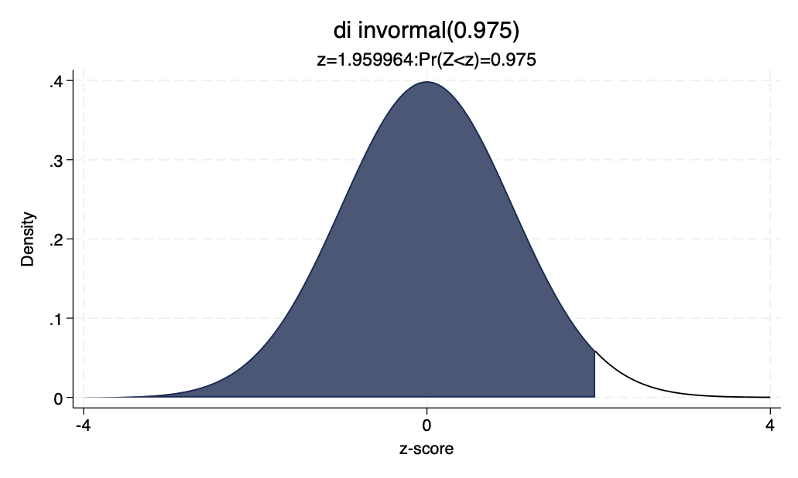
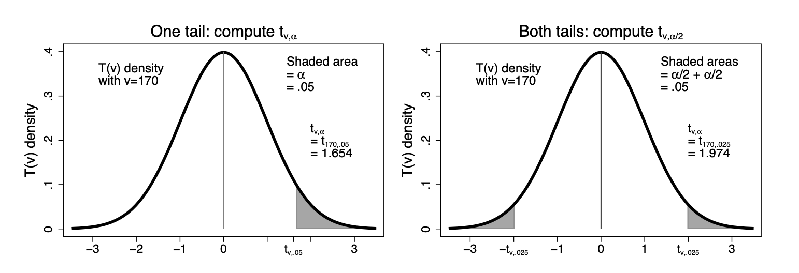

```{r}
#| label: setup
#| include: false
require("Statamarkdown")
```

## Introduction: Inferring Population Parameters

Previously, we characterized the sample mean $\bar{X}$ as an unbiased and consistent estimator for the population mean $\mu$. We showed that, under certain conditions, we can expect $\bar{X}\sim N(\mu,\sigma^2/n)$. However, we usually do not know $\mu$ or $\sigma$, and want to use the computed sample mean $\bar{x}$ from a *single sample* to make inferences about our population parameters.

## Example Dataset: Stata Auto {.smaller shrink=20}

For example, let's look at a sample of data given in Stata.

```{stata}
#| label: describe
#| collectcode: true
#| echo: true
sysuse auto
describe // what variables are we working with?
```

## Sample Statistics for Car Price {.smaller shrink=20}

We see that $\bar{x}=6165.257$ for this sample of $n=74$. However, we know that we would likely have gotten a different value for $\bar{x}$ if we had (theoretically) drawn a different sample. Do we have enough information to say that average car price *in the population* in 1978 is above \$6000? That it is different from \$5500? To answer this, we need more tools for statistical inference.

```{stata}
#| label: summarize
#| echo: true
summarize price
```

## Computing the Standard Error {.smaller shrink=20}

The previous summary gives us our obs, mean, and standard deviation for our sample, but we may want our standard error (of the sample mean) computed as well. To have Stata generate this, we use the following command:

```{stata}
#| label: mean
#| echo: true
mean price
```

## Null and Alternate Hypotheses

Let us use this information to *test our hypothesis* that the average car price in the population in 1978 is different than \$5500 using our sample. To do this, we first write a **null** and **alternate hypothesis** for the *population parameter* we are testing:
\begin{align*}
H_0: \mu &= 5500 \\
H_A: \mu &\neq 5500
\end{align*}
The null hypothesis is what we are trying to *disprove* with our test. If our test is successful, we will *reject* the null hypothesis. If our test is not successful, we will *fail to reject* the null hypothesis.

## One-Sided vs. Two-Sided Tests

Because we are testing whether or not our population mean $\mu$ is *different* from \$5500, we call this a **two-sided** hypothesis test. We could reject our null hypothesis because $\bar{x}$ is significantly higher or lower than \$5500, so we are testing on both sides.

If instead we were testing the claim that average population car price was *above* \$6000, this would be a **one-sided** hypothesis test, as we are only rejecting the null for values significantly above \$6000 but not below. Then, our hypotheses would be
\begin{align*}
H_0: \mu &\leq 6000 \\
H_A: \mu &> 6000
\end{align*}

## Standardizing the Sample Mean: Z-Score

Previously, we had transformed our sample mean r.v. $\bar{X}$ into a standard normal (with $n>30$) by: $$Z=\frac{\bar{X}-\mu}{\sigma/\sqrt{n}}\sim N(0,1)$$ We called this distribution $N(0,1)$ the *standard normal distribution*. This transformation is useful because we know (or can calculate) exactly the probability of lying above or below any z-score value, or conversely the z-score value corresponding to any probability mass of data.

## The Normal Distribution: 68-95-99.7 Rule

The normal distribution has a rule of thumb associated with it: we know that roughly 68% of data will lie within one standard deviation of the mean, 95% will lie within 2 standard deviations, and 99.7% will lie within three standard deviations.

For any given z-score value, we can compute the exact probability mass of data that lies to the left or right of a given value. Since the (standard) normal distribution is symmetric, we can perfectly fold the distribution in half over the y-axis.

## Standard Normal Density Plot

```{stata}
#| label: density
#| results: false
twoway function y=normalden(x), range(-4 4) title("Standard normal density") xlab(-4(1)4) ytitle("Density") xtitle("z-score")
gr export L4normal.png, replace
```

{width=100% fig-alt="Plot of the standard normal density function. The x-axis shows z-scores from −4 to 4 with tick marks at each integer, and the y-axis shows density. The symmetric bell-shaped curve is centered at zero and labeled 'Standard normal density'."}

## Normal Probabilities in Stata

We can use the code below to get the probability mass to the *left* of any z-score, or inversely the z-score associated with a probability mass to its left of some amount.

```{stata}
#| label: normal
#| echo: true
di normal(1) // Pr(Z<1)
di invnormal(0.975) // z:Pr(Z<z)=97.5%
```

We see from this that roughly 84.1% of data in the standard normal distribution lies below a z-score of 1, and a z-score of roughly 1.96 has 97.5% of the probability mass to its left.

## di normal(1): Left-Tail Probability Plot

```{stata}
#| label: new-normal
#| results: false
local p : di normal(1)
twoway function y=normalden(x), range(1 4) color(black) || ///
function y=normalden(x), range(-4 1) recast(area) color(dknavy) ///
xtitle("z-score")  legend(off) ytitle("Density") title("di normal(1)") ///
subtitle("Pr(Z<1)=`p'") legend(off) xlabel(-4 0 1 4)
gr export L4norm.png, replace

local z : di invnormal(0.975)
twoway function y=normalden(x), range(-4 1.96) recast(area) color(dknavy) || ///
function y=normalden(x), range(1.96 4) xtitle("z-score") color(black) legend(off) ///
ytitle("Density") title("di invormal(0.975)") subtitle("z=`z':Pr(Z<z)=0.975") ///
xlabel(-4 0 4)
gr export L4invnorm.png, replace
```

{width=100% fig-alt="Standard normal density curve with the area to the left of z=1 shaded in dark navy, illustrating Pr(Z<1). The x-axis is labeled at −4, 0, 1, and 4. The plot title reads 'di normal(1)' and the subtitle shows the computed probability value."}

## di invnormal(0.975): Inverse Normal Plot

{width=100% fig-alt="Standard normal density curve with the area to the left of z≈1.96 shaded in dark navy, illustrating invnormal(0.975). The x-axis is labeled at −4, 0, and 4. The plot title reads 'di invormal(0.975)' and the subtitle shows z≈1.96 such that Pr(Z<z)=0.975."}

## Recap: Stata Normal Functions

To recap:

- `di normal(z)` gives us the probability mass to the left of a given z-score

- `di invnormal(p)` gives us the z-score such that the probability mass to the left of that z-score is equal to $p$

- "di" is just Stata for "display"

## Limitation: Estimating the Standard Deviation

Unfortunately, all of the work we just did above relies on a standard normal distribution and z-scores, which requires us to know $\sigma/\sqrt{n}$, the population standard deviation of $\bar{X}$. The best we can do, however, is estimate $\sigma/\sqrt{n}$ using $s/\sqrt{n}$, our standard error for $\bar{X}$.

When we replace $\sigma/\sqrt{n}$ with $s/\sqrt{n}$ in our z-score formula, we get a distribution that is *almost* standard normal but not exactly.

## The T Distribution

Instead, we now have $$T=\frac{\bar{X}-\mu}{S/\sqrt{n}}$$

The T distribution is a bit more complicated that the standard normal, as it depends on our *degrees of freedom* for its shape (symmetric and close to normal, but with kurtosis $>3$). We say $T\sim T(n-1)$, where $n-1$ represents our degrees of freedom.

. . .

Note: every T distribution with the same degrees of freedom will have the same shape. Thus, we can fully characterize the distribution we are working with by computing $n-1$. For the standard normal distribution this was not the case - the standard normal distribution looks exactly the same for any/all values of $n$ (does not depend on degrees of freedom).

## The T-Statistic

For an observed sample mean $\bar{x}$, we can construct a **t-statistic** $$t=\frac{\bar{x}-\mu_0}{se(\bar{x})}=\frac{\bar{x}-\mu_0}{s/\sqrt{n}}\sim T(n-1)$$ whenever $n>30$. To compute the t-statistic for a given null hypothesis, we plug in the parameter value assumed under the null, $\mu_0$. From our previous null hypothesis, $\mu_0=5500$.

. . .

Thus, we can finally compute the t-statistic from our previous test: $$t=\frac{6165.257-5500}{342.8719}=1.94\text{ with }df=n-1=73$$

## Evaluating the T-Statistic: P-Values and Significance

We have found that $t=1.94$ for our earlier hypothesis test for car price. However, we need a threshold to compare this value to to decide whether we can reject our null hypothesis.

. . .

Computing a z- or t-statistic from a distribution with a known density function means we can compute the probability of drawing a statistic at least as large from that distribution. We call this quantity our **p-value**: the probability of drawing a [t-]statistic *at least as large* as 1.94 *if we were to draw another sample and compute a new [t-]statistic* **under the null distribution**.

. . .

We set a threshold for this likelihood value we call the **significance level**, denoted by $\alpha$. In Economics, we commonly take $\alpha=0.05$, or a $\frac{1}{20}$ chance being low enough to reject our null hypothesis. However, we may alternatively use $\alpha=0.1$ or $\alpha=0.01$.

## Courtroom Analogy: Hypothesis Testing

Thought experiment: someone on trial. In the US, we assume defendants are innocent until proven guilty. Thus, our hypotheses in the courtroom for the outcome of a trial $\theta$ are:
$$H_0:\theta=\text{innocent}$$
$$H_A:\theta\neq\text{innocent}$$

. . .

We assess the evidence against a defendant assuming they are innocent and compute the probability that an innocent person would have as much evidence against them as our defendant does (p-value). If the probability of an innocent person having this much evidence against them is below 5% or $\frac{1}{20}$, we reject the null (innocence) and assert that the defendant is guilty (alternate).

. . .

However, being found not guilty does not mean there is *no evidence* against our defendant. It simply means we have *insufficient evidence* to prove their guilt or *fail to reject the null*.

## P-Value vs. Critical Value Approaches

There are two ways of comparing our computed t-statistic to our significance level. We can either:

- Convert our t-statistic into the p-value associated with that t-statistic and compare that to $\alpha=0.05$. A p-value *less than* $\alpha$ means it is *very unlikely* that we drew such a statistic under the **null distribution** and thus we reject our null hypothesis.

- Convert our significance level $\alpha$ into a t-**critical value**, the t-score ($t^*_{df}$) at which $\Pr(T>t^*_{df})=\alpha$. If our computed t-statistic is *larger* than our critical value, we again say that it is *very unlikely* that we drew such a statistic under the **null distribution** and thus we reject our null hypothesis.

## Stata: ttail and invttail Functions

Like before, Stata gives us functions to compute p-values and t-critical values:

- `di ttail(df,t)` gives us the probability mass to the RIGHT of a given t-stat for $df=n-1$

- `di invttail(df,α)` gives us the t critical value $t^*_{df}$ such that the probability mass to the RIGHT of that t-stat is equal to $\alpha$ for $df=n-1$

**Hint**: in exams, it is typical to provide a table of invttail() output for a range of significance values and the degrees of freedom of a sample. Thus, the **p-value** approach for hypothesis testing is less common on exams than the **critical value** approach.

## One-Sided vs. Two-Sided Critical Values

However, we must now again consider one- versus two-sided tests. In a one-sided test, we are only testing above OR below a given point, so we can use invttail(df,$\alpha$) as normal. In two-sided tests, however, we are testing both the upper and lower tails of the distribution simultaneously. Thus, for two-sided tests we need to compute $t^*_{df}:\Pr(|T|>|t^*_{df}|)=\alpha$ or equivalently $t^*_{df}:\Pr(T>t^*_{df})=\alpha/2$ due to symmetry of our t-distribution.

Remember, our t-distribution is symmetric, so it must be true that $\Pr(T > t^*_{df}) = \Pr(T < -t^*_{df})$. Also, since our probabilities must sum to 1, $\Pr(T \geq t^*_{df}) = 1-\Pr(T < t^*_{df})$.

## T Distribution: Tail Regions

{width=100% fig-alt="Diagram of the t-distribution showing critical regions for hypothesis testing. The symmetric bell-shaped curve has shaded tail areas illustrating rejection regions for one-sided and two-sided tests, with labeled critical values on the horizontal axis."}

## Practice: T-Distribution Probabilities

Let's practice `ttail()` and `invttail()` for a few one- and two-sided test examples with $n=39$:

- $\Pr(T > 1.6)$

- $\Pr(|T| > 0.8)$

- $\Pr(T < 1.3)$

- $\Pr(|T|< 1)$

- $t^*_{38}:\Pr(T>t^*_{38})=0.025$

- $t^*_{38}:\Pr(|T|>|t^*_{38}|)=0.1$

- $t^*_{38}:\Pr(T<t^*_{38})=0.3$

## Practice Solutions: T-Distribution Probabilities

Let's practice `ttail()` and `invttail()` for a few one- and two-sided test examples with $n=39$ ($df=n-1=38$):

- $\Pr(T > 1.6)$: `di ttail(38,1.6)`

- $\Pr(|T| > 0.8)$: `di 2*ttail(38,0.8)`

- $\Pr(T < 1.3)$: `di 1-ttail(38,1.3)`

- $\Pr(|T|< 1)$^[We should expect this to be close to 68% based on our 68-95-99.7 rule.]: `di 1-2*ttail(38,1)`

- $t^*_{38}:\Pr(T>t^*_{38})=0.025$: `di invttail(38,0.025)`

- $t^*_{38}:\Pr(|T|>|t^*_{38}|)=0.1$: `di invttail(38,0.1/2)`

- $t^*_{38}:\Pr(T<t^*_{38})=0.3$: `di invttail(38, 1-0.3)`

## Hypothesis Test Result: Car Price {.smaller shrink=20}

Finally, we are ready to answer our hypothesis test from the beginning. We computed $t=1.94$ for $n=74$ with hypotheses
\begin{align*}
H_0: \mu &= 5500 \\
H_A: \mu &\neq 5500
\end{align*}
We compute our critical value $t^*_{df,\alpha/2}$ for $\alpha=0.05$

```{stata}
#| label: invttail
#| echo: true
di invttail(74-1,0.05/2)
```

and find $t^*_{73,0.025}=1.993$. Since $1.94<1.993$, we *fail to reject* our null hypothesis that $\mu=5500$. However, importantly, *we do not accept the null*. We simply say that we fail to reject the null *for this particular sample*.

## Recap: Critical Value and P-Value Methods

To recap: two-sided hypothesis tests require us to divide $\alpha$ by 2 when we are using the critical value approach, because the probability mass is being split equally between the upper and lower tails of the distribution. For a one-sided test, all the mass is in either the upper or lower tail, so we can take $\alpha$ as given.

The p-value approach converts our t-statistic into its p-value and rejects the null if that value is less than our significance level. The critical value approach converts $\alpha$ or $\alpha/2$ into a critical value $t^*_{df,\alpha[/2]}$ and rejects the null if our computed t-statistic is larger (in absolute value) than our critical value.

## Confidence Intervals: Concept

Finally, **confidence intervals** (CIs) are the inverse of two-sided hypothesis tests. If a two-sided test gives the chance that we draw our computed statistic under the null distribution, a confidence interval gives a range of values around our computed statistic that we can be some % sure contains our true parameter value.

. . .

While it is unknown, our true population parameter $\mu$ is some fixed value and not probabilistic. Thus, it is incorrect to say "$\mu$ has an X% chance of lying in this range". Instead, we say "This range has an X% chance of *including*/*covering* the true value of $\mu$".

. . .

Since our confidence interval depends on $se(\bar{x})$ and $se(\bar{x})$ in turn shrinks with $n$, our confidence interval will *shrink* as $n\rightarrow\infty$. Intuitively, a 90% CI will also be narrower than a 95% CI, as it covers fewer possible values for $\mu$.

## Confidence Interval Formula

The confidence interval formula uses all the same components as our t-statistic, but in a slightly different order. The $100(1-\alpha)$% confidence interval for $\mu$ given some $\bar{x}, n, se(\bar{x})$ is given as $$\bar{x}\pm \underbrace{t^*_{n-1,\alpha/2}\times se(\bar{x})}_{\text{"margin of error"}}$$ This range has a $100(1-\alpha)$% chance of containing the true population parameter value $\mu$. When reporting a CI, we need to always give two values $(lower,upper)$.

## Confidence Intervals as Inverse Hypothesis Tests

We can demonstrate the claim that two-sided hypothesis tests are the inverse of confidence intervals below:
$$\underbrace{t_{n-1}=\frac{\bar{x}-\mu_0}{se(\bar{x})}}_{\text{2-sided t-test}} \leftrightarrow\underbrace{\bar{x}\pm t^*_{n-1,\alpha/2}\times se(\bar{x})=(\mu_0^{smallest},\mu_0^{largest})}_{100(1-\alpha)\%\text{ confidence interval}}$$ (Formal proof ch. 4.3.3, pg. 66-67)

Our 2-sided t-test gives us the probability of getting a t-statistic at least as large as the one we got (in absolute value) under the null hypothesis assumption $\mu_0$. A confidence interval will instead give us the smallest and largest values for $\mu_0$ we could assume under the null hypothesis for which we would *fail to reject the null*.

## Key Equivalences: Tests and Confidence Intervals

**Very important**:

$\Rightarrow$ Since our p-value and critical value approaches are inverse operations of each other, *both should always give us the same conclusion* of whether we reject or fail to reject our null hypothesis.

$\Rightarrow$ Similarly, since our 2-sided hypothesis test and confidence interval calculation are inverse operations of each other, *both should always give us the same conclusion* of whether we reject or fail to reject our null hypothesis. When we reject a two-sided hypothesis test for some $\mu_0,\bar{x},n,se(\bar{x})$, that $\mu_0$ should also fall *outside* the range of our $100(1-\alpha)$% confidence interval for $\mu$.

## Interpreting and Choosing Confidence Intervals

How do we interpret CIs? We may think that we want the largest CI possible to be as sure as we can that we are covering the true value of $\mu$. However, this is misguided: the range $(-\infty,\infty)$ has a 100% chance of covering all possible values of $\mu$ for any and all distributions, but this is not informative for statistical inference. We typically select a 90% or 95% CI in Economics. Stata will automatically report a 95% CI for $\mu$ with the *mean* command.

For a single sample (and a single $\bar{x}$), our CI will have a $100(1-\alpha)$% chance of covering the true value of $\mu$. If we repeatedly resample a large number of times and compute an $\bar{x}$ and CI for each sample, we expect that $100(1-\alpha)$% of those CIs *will* cover the true value of $\mu$.

## 95% CI for Car Price {.smaller shrink=20}

```{stata}
#| label: mean-again
#| echo: true
mean price
```

95% CI for $\mu_{price}=(5481.914,6848.6)$. This range has a 95% chance of including the true population value of $\mu_{price}$.

The value we assumed under the null above, \$5500, falls *within* this range, $5500\in(5481.914,6848.6)$, so it should not be surprising that we *failed to reject the null* for our 2-sided t-test above.

# End of Lecture Material

## Knowledge Check 4

Suppose we compute $\bar{x}=4.5$ and $s_{\bar{x}}=1$ for a sample of data and $t^*_{n-1,0.05}=1.69$ and $t^*_{n-1,0.025}=2.03$ for our sample size $n$.

Test the claims that:

:::: {.columns}
::: {.column width="50%"}
$\mu\neq4$
:::
::: {.column width="50%"}
$\mu>2$
:::
::::
