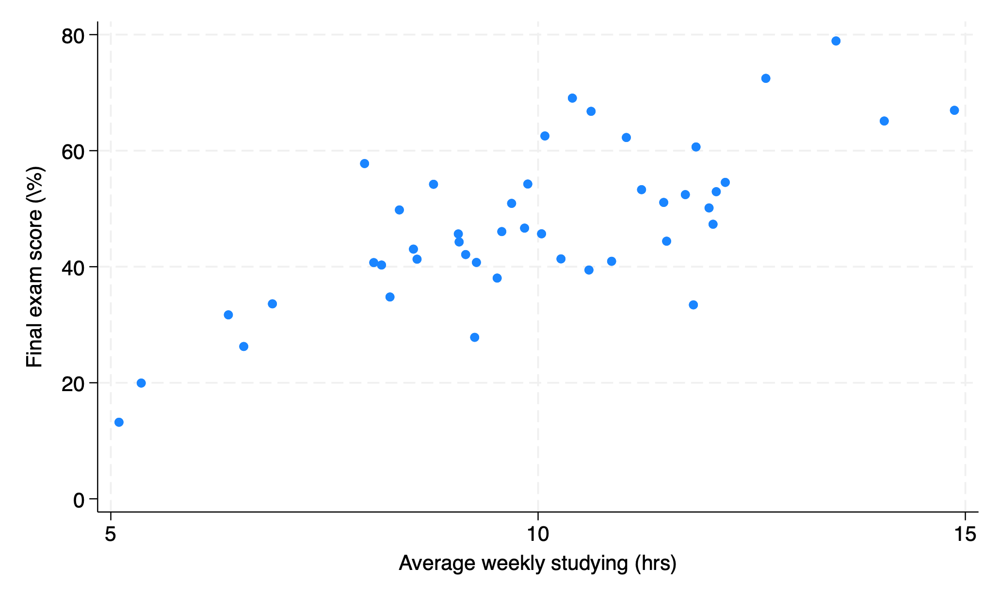
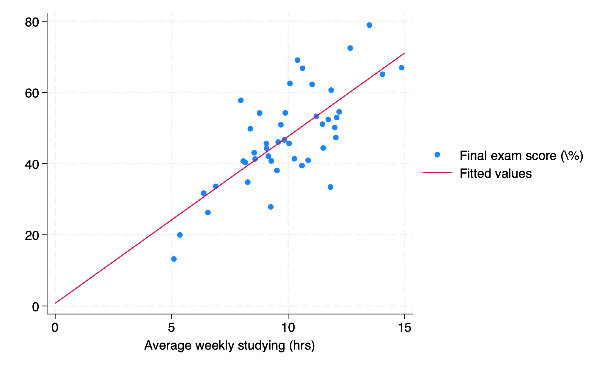
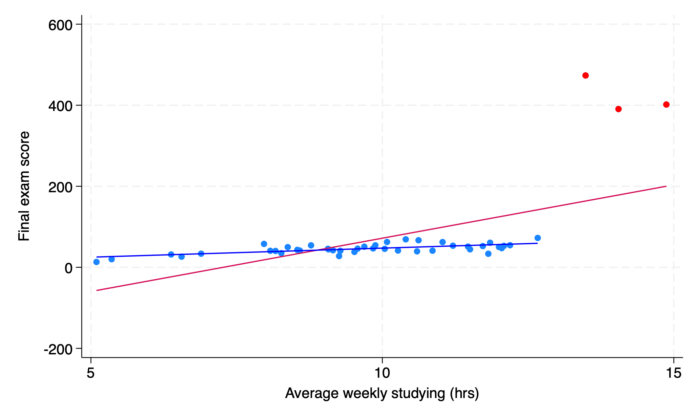

```{r}
#| label: setup
#| include: false
require("Statamarkdown")
```

# Correlation and covariance

## Introduction: Bivariate Data

We will now shift our discussion from univariate data to **bivariate** data involving two variables. While we typically think of these as $x$ and $y$, remember that we cannot make claims about causality with the methods we will learn in this class - for a given $(x,y)$, we should not claim that $y=f(x)$ or $x=f(y)$.

## Example: Studying and Exam Scores

Let's say we want to investigate the relationship between average hours spent studying each week and performance on an exam. Let $x$ be hours spent studying and $y$ be exam scores for a sample of 45 students (what type of data is this?)

How can we analyze the *correlation* between these two variables?

## Visualizing Co-movement: The Scatterplot

We often start with a **scatterplot** of our two variables plotted against each other. It is sometimes immediately obvious whether or not there is co-movement of our two variables.

```{stata}
#| label: scatter
#| results: false
#| collectcode: true
set obs 45
g x = rnormal(10,2)
g e = rnormal(0,10)
g y = 5*x + e
la var x "Average weekly studying (hrs)"
la var y "Final exam score (\%)"
sc y x
gr export l5scatter.png, replace
```

{width=90% fig-alt="Scatterplot of 45 simulated students showing a positive linear association between average weekly studying hours (x-axis) and final exam score as a percentage (y-axis). Points are scattered around an upward-sloping trend with no observations below roughly 30% or above 80%."}

## Stata: scatter Command

To make this plot, we would use the following code with our variables $x$ and $y$:

```{stata}
#| label: example
#| echo: true
#| results: false
scatter y x
```

Just like we will see in regression, we put our **outcome** or **dependent** variable, $y$, first and our **explanatory** or **independent** variable, $x$, second.

## Measuring Co-movement: Covariance

A scatterplot is a good visual guide, but we want a more numeric way of evaluating the co-movement of $x$ and $y$. One such quantity is the **covariance** of x and y, denoted $s_{xy}$: $$s_{xy} = \frac{1}{n-1}\sum_{i=1}^n(x_i-\bar{x})(y_i-\bar{y})$$

What does this formula remind you of?

. . . 

The covariance of a variable with itself will just be equal to its sample variance: $$s_{xx} = \frac{1}{n-1}\sum_{i=1}^n(x_i-\bar{x})(x_i-\bar{x})=\frac{1}{n-1}\sum_{i=1}^n(x_i-\bar{x})^2=s^2_x$$

## Interpreting the Covariance

Once we compute our covariance, we can use it to tell us how x and y are co-moving: a positive covariance indicates a positive association, zero covariance indicates no association (or **independence**), and a negative covariance indicates a negative association.

However, just like with two standard deviations, we cannot directly compare the covariance of two different pairs of variables to say which is co-moving more closely, because our series may be on drastically different scales.

## Sample Correlation Coefficient

To convert our *covariance* into a standardized measure of association, we can divide by the (sample) standard deviation of both x and y. This new quantity is called our **sample correlation coefficient**, $r_{xy}$: $$r_{xy}=\frac{s_{xy}}{s_xs_y}=\frac{Cov(x,y)}{s_xs_y}$$

. . .

We can plug in our formulas for these quantities to get $$r_{xy}=\frac{\sum_{i=1}^n(x_i-\bar{x})(y_i-\bar{y})}{\sqrt{{\sum_{i=1}^n(x_i-\bar{x})^2}}\sqrt{{\sum_{i=1}^n(y_i-\bar{y})^2}}}$$

## Simplifying the Correlation Formula

Technically, we are missing a piece from our numerator and denominator: $\frac{1}{n-1}$:

$$r_{xy}=\frac{\sum_{i=1}^n(x_i-\bar{x})(y_i-\bar{y})/(n-1)}{\sqrt{\frac{\sum_{i=1}^n(x_i-\bar{x})^2}{n-1}}\sqrt{\frac{\sum_{i=1}^n(y_i-\bar{y})^2}{n-1}}}$$

However, since both quantities have the same multiplicative factor, we can cancel them out and get the simplified formula above.

Our *correlation coefficient*, $r_{xy}$, will have the same sign as our covariance, but will now be bound to a standardized scale: $-1\leq r_{xy} \leq 1$.

## Population vs. Sample Correlation

Just like we had a sample mean, $\bar{x}$, that we used to estimate our population mean, $\mu$, we are using our sample correlation coefficient $r_{xy}$ to estimate our population correlation coefficient $\rho_{xy}$ ("rho"). Since this population correlation value is unknown, we could also conduct hypotheses testing on $\rho$ using our sample estimate $r_{xy}$ to make inference about the population (linear) relationship between $x$ and $y$.

## Correlation and Nonlinearity

We can interpret the correlation coefficient as a good measure of the association between our two variables with an important caveat: if the true relationship between our variables is nonlinear, we may observe $r_{xy}=0$ for series that are not truly independent. However, series that are independent will always have $r_{xy}=0$.

We say that having zero correlation is **necessary but not sufficient** to say two series are independent.

## Interpreting and Computing Correlation

While we have standardized our measure of co-movement between our two variables, we have not yet identified thresholds at which a correlation is "strong" vs. "weak". However, the closer our correlation is to $\pm1$, the stronger we consider it.

We can find correlation between two series with the following Stata code (the order of variables does not matter):

```{stata}
#| label: corr
#| echo: true
corr y x // or corr x y
```

# Regression

## Introduction to Regression

We now move to the standard methodology for determining the relationship between two variables in Economics: regression. At its most basic, this is just adding a best fit line to a scatterplot.

Our regression of y on x is given as: $$\hat{y}=b_1+b_2x$$

- $y$ is our dependent variable, $x$ is our independent variable

- $\hat{y}$ is called our **fitted** or **predicted** value

- $b_1$ is our **intercept** and $b_2$ is our **slope coefficient**

## Regression Residuals

Of course, our regression line will not go through every (or any) data point perfectly. The amount that our regression line misses each data point is called the **residual**, denoted $e$: $$e=y-\hat{y}$$ For a given data point $i$: $$e_i=y_i-\hat{y}_i=y_i-b_1-b_2x$$

## Minimizing Residuals: The OLS Criterion

We think that a good regression line is one that *minimizes residuals*. However, we cannot simply take $\sum_{i=1}^n e_i$ - why not?

. . .

$\Rightarrow\sum_{i=1}^n e_i=0$ always!

Instead, we typically choose the estimator that minimizes the **sum of squared residuals**: $$\arg\min_{b1,b2}\left\{\sum_{i=1}^n e_i^2\right\}$$

## Deriving the OLS Estimator

How do we minimize $\sum_{i=1}^n e_i^2$? Like with any function, we take a derivative and set it equal to zero!

\begin{align*}
\sum_{i=1}^n e_i^2 &= \sum_{i=1}^n(y_i-\hat{y}_i)^2 \\
&= \sum_{i=1}^n(y_i-b_1-b_2x_i)^2
\end{align*}

$$\frac{\partial}{\partial b_1,b_2} \sum_{i=1}^n(y_i-b_1-b_2x_i)^2=...$$

## OLS Estimator Formulas

The solution to this problem involves quite a lot of algebra, so I will present the final formulas for $b_1$ and $b_2$:

$$b_2=\frac{\sum_{i=1}^n(x_i-\bar{x})(y_i-\bar{y})}{\sum_{i=1}^n(x_i-\bar{x})^2}$$

$$b_1 = \bar{y}-b_2\bar{x}$$

What does our formula for $b_2$ remind you of?

. . .

$$b_2=\frac{Cov(x,y)}{Var(x)}$$

## Slope Coefficient and Correlation

It can be shown that: $$b_2=r_{xy}\times\frac{s_y}{s_x}$$ This identity allows us to relate our estimated slope coefficient to our correlation coefficient.

If we were to z-transform both x and y, we would have $s_y,s_x=1$ and thus $b_2=r_{xy}$. This identity then allows for greater interpretation of the correlation coefficient when we standardize our data: a 1-standard deviation increase in x is now associated with a $b_2=r_{xy}$-standard deviation change in y.

## Interpreting the OLS Estimator

We call the resulting estimator for $b_2$ the **OLS** estimator, or Ordinary Least Squares. We will discuss what each of these names mean later on. For now, we know that this is the estimator for the association between y and x that minimizes our predictive errors for y.

We can also interpret our $b_2$ as the slope of our line of best fit and $b_1$ as our y-intercept. If we have Stata put a best fit line on our scatterplot, its slope and intercept will be exact equal to the $b_1,b_2$ Stata estimates from regressing y on x.

Let's return to our studying and grades example.

## Scatter Plot with Best Fit Line

```{stata}
#| label: lfit
#| results: false
scatter y x, xsca(r(0, 15)) || lfit y x, range(0, 15)
gr export l5scatterlfit.png, replace
```

{width=100% fig-alt="Scatterplot of studying hours (x-axis, 0–15 hours) versus final exam score (y-axis, percentage) for 45 simulated students, with an OLS best fit line overlaid spanning the full x-axis range. The positive linear trend of the data is captured by the upward-sloping regression line."}

## Estimating the Regression {.smaller shrink=30}

\vspace{2em}

Let's check if our estimated regression matches our best fit line:

```{stata}
#| label: reg
#| echo: true
regress y x
```

$$\hat{y}=\underbrace{0.75}_{b_1}+\underbrace{4.69}_{b_2}x$$

We see that our estimated regression line is exactly the same as our best fit line, as expected.

## Predicting Values from the Regression

We now have our model for the regression of y on x: $$\widehat{grade}_i=0.75+4.69hours_i$$

We can also use this to **predict** scores: what would we expect the final grade to be for someone who averages 5 hours of studying per week? 10 hours? 15 hours? 30 hours?

. . . 

$$\widehat{grade}_{5hrs}=0.75+4.69\times5=24.2\%$$

$$\widehat{grade}_{10hrs}=0.75+4.69\times10=47.7\%$$

$$\widehat{grade}_{15hrs}=0.75+4.69\times15=71.2\%$$

$$\widehat{grade}_{30hrs}=0.75+4.69\times30=\textcolor{red}{141.45}\%$$

# Model fit

## Introduction: Model Fit

We have now identified the estimator for a linear association between y and x that minimizes the sum of squared residuals and used that best fit line to predict values of y based on values of x. However, we should also consider how well this **model fits** our data: how close are our data points to our fitted regression line?

## Standard Error of the Regression

We have two measures we typically use to measure **model fit** for bivariate regression, the first of which is **standard error of the regression**, denoted $s_e$. This is roughly the standard deviation of the residual:
$$s_e=\sqrt{\frac{1}{n-2}\sum_{i=1}^n(y_i-\hat{y})^2}$$

. . .

Why do we now divide by $n-2$ instead of $n-1$? When we compute our fitted values $\hat{y}$, we use both $b_1$ and $b_2$ that we estimate from our squared error minimization. Since we include two previously computed quantities in our calculation of the standard error for the regression, we lose two *degrees of freedom*.

## RMSE: Root Mean Squared Error

$$s_e=\sqrt{\frac{1}{n-2}\sum_{i=1}^n(y_i-\hat{y})^2}$$

This quantity is also sometimes called the **Root Mean Squared Error (RMSE)**, since it is the square root of the average squared residual (error) of the regression. Like with our standard error for the sample mean, this quantity is an estimator for the true (unknown) standard deviation of the residual. Like with covariance, however, our RMSE is not on a standardized scale, making interpreting its magnitude difficult.

## Introducing R-Squared

To address the issue of our RMSE not being standardized, we introduce a second measure of model fit: **R-Squared**.

## Sums of Squares: TSS, ExpSS, and ResSS

**R-squared** is the *fraction of variation in y (around its sample mean $\bar{y}$) that is explained by the regressor (x)*. We need to introduce three (similar-looking) sums to calculate $R^2$: $$TSS=\sum_{i=1}^n(y_i-\bar{y})^2$$ $$ExpSS=\sum_{i=1}^n(\hat{y}_i-\bar{y})^2$$ $$ResSS=\sum_{i=1}^n(y_i-\hat{y}_i)^2$$

## Total Sum of Squares (TSS)

TSS or the **total sum of squares** measures variation in $y$ around its sample mean $\bar{y}$:

$$TSS=\sum_{i=1}^n(y_i-\bar{y})^2$$

## Explained Sum of Squares (ExpSS)

ExpSS or **explained sum of squares** measures variation in the fitted values of $y$, $\hat{y}$, around the sample mean $\bar{y}$:

$$ExpSS=\sum_{i=1}^n(\hat{y}_i-\bar{y})^2$$

## Residual Sum of Squares (ResSS)

ResSS or **residual sum of squares** is the sum of squared residuals between our true values $y$ and our fitted values $\hat{y}$. Notice, $ResSS=e_i^2$.

$$ResSS=\sum_{i=1}^n(y_i-\hat{y}_i)^2$$

## R-Squared Formula

Finally, our measure R-squared is the *ratio of explained sum of squares to total sum of squares*:

$$R^2=\frac{ExpSS}{TSS}=1-\frac{ResSS}{TSS}$$

This is also sometimes called the **coefficient of determination**. We interpret this quantity as "($100\times R^2$) *percent of the variation in $y$ is explained by/accounted for by (variation in) $x$*" for a given $x$ and $y$ variable.

Like our correlation coefficient, $R^2$ is bounded by $0\leq R^2\leq1$ since $r_{xy}^2=R^2$. Our OLS estimator that minimizes $\sum_i e_i^2$ also then maximizes our $R^2$ by definition.

## R-Squared in Multivariate Regression

As an added bonus, $R^2$ is able to be used for *multi*variate regressions, or those with more than one regressor, which we will see later, as we cannot compute the correlation of more than two variables. Also, it can be shown that $r_{xy}^2=r_{yx}^2=R^2$, meaning it does not matter for our bivariate regression which variable is our regressor and which is our outcome. However, *the coefficients we obtain from these regressions will not be reciprocals of each other ($a_1\neq b_1^{-1};a_2\neq b_2^{-1}$) - proof Ch. 5 pg. 115.*

## Interpreting R-Squared Magnitude

We now have a standardized measure of model fit, $0\leq R^2\leq1$. However, what is a good fit? What is a bad fit?

To judge the $R^2$ of a model, we need to think about what we are predicting. Low values of $R^2$ do not necessarily mean our model is bad; they might instead mean that our x has a small but not insignificant effect on y. For example, the effect of a tax cut on GDP. We may think the tax cut did impact GDP and want to measure its effect, but with all the other things affecting GDP the $R^2$ for such a regression is likely to be quite low. In this case, think about what it would mean for a single tax cut to explain 5% or 10% of variation in GDP!

## Comparing R-Squared Across Models

Furthermore, since our $R^2$ is constructed with the variation of y, we *can only compare the $R^2$ of models that share the same outcome variable.* If we perform a nonlinear transformation our y variable (say, taking a log) or substitute in a different y variable, we can no longer compare the $R^2$ of our two models.

Thus, $R^2$ is most helpful in multivariate regressions where we can fix an outcome variable and test how our $R^2$ changes when we add or remove regressors.

## Regression Output Revisited {.smaller shrink=30}

\vspace{2em}

Let us return to our previous regression, now knowing these measures of model fit:

```{stata}
#| label: reg-again
reg y x
```

What is our $s_e$? What is our $R^2$? What do these mean?

. . . 

$$s_e=9.35; R^2=0.54$$ 

Our model explains 54% of the variation in final exam scores, and our RMSE is 9.35. 

## Reading Sums of Squares in Stata {.smaller shrink=30}

\vspace{2em}

```{stata}
#| label: reg-third
reg y x
```

Stata reports our three sums of squares with `regress`. We can verify that $ExpSS+ResSS=TSS$ and $R^2=ExpSS/TSS$:

- TSS=8193

- ExpSS (ModelSS)=4435

- ResSS=3758

## Outliers and Regression

*Outliers* can have an outsize effect on the slope of our regression line. Consider the following example:

```{stata}
#| label: outlier
#| results: false
replace y = 6*y if x>13
la var y "Final exam score"
sc y x || lfit y x || lfit y x if x < 13, lcolor(blue) || sc y x if x > 13, color(red) legend(off)
gr export l5outlier.png, replace
```

{width=80% fig-alt="Scatterplot of studying hours versus final exam scores with two OLS fitted lines overlaid. The full-sample regression line is shown in the default color, and a second line fit only to observations with x less than 13 hours is shown in blue. Outlier observations with x greater than 13 are highlighted in red, demonstrating how high-leverage outliers pull the full-sample regression line upward relative to the main data cloud."}

# End of lecture material

## Knowledge Check 5

Say we perform a regression of y on x and get the following results: $\hat{y}=3+2x$, $TSS=200,ResSS=50$, $n=73$

a) What is $R^2$ What does this quantity mean in words?

b) What are our $b_1$ and $b_2$ coefficients? What do these mean?

c) What can we say about $\sum_i e_i$ for this regression? What can we say about $\sum_i e_i^2$? How many degrees of freedom does our $s_e$ have and why?

d) If we were to instead regress x on y, what would our $R^2$ be equal to? What would our new regression coefficients $a_1,a_2$ be equal to?
