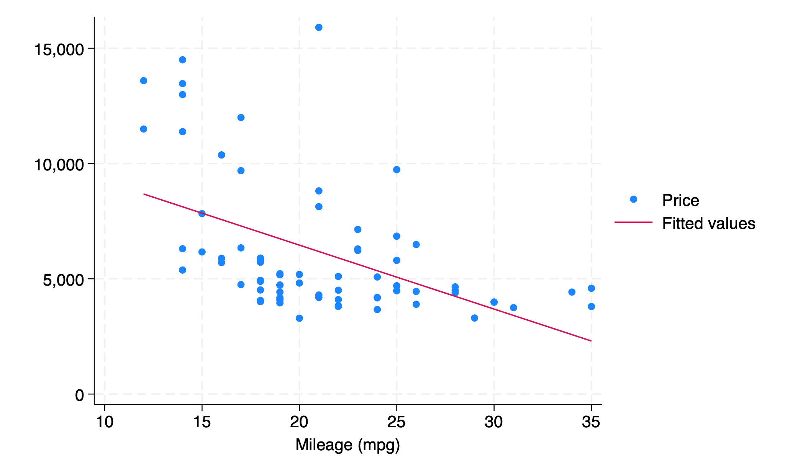

```{r}
#| label: setup
#| include: false
require("Statamarkdown")
```

## Asymptotic Normality and the T-Statistic

Previously, we said that our OLS estimator $b_2$ was *asymptotically normal* with $b_2\sim N(\beta_2,\sigma^2_{b_2})$ or that $\frac{b_2-\beta_2}{\sigma_{b_2}}\sim N(0,1)$ when $n>30$.

Without knowing $\sigma_u$ we cannot know $\sigma_{b_2}\left(=\frac{\sigma_u}{\sum_{i=1}^n(x_i-\bar{x})^2}\right)$

Instead, we replace $\sigma_u$ with $s_e$ and construct $T\sim(n-2)$.

We can now use this asymptotic normality to conduct hypothesis testing on our estimated slope coefficient, similar to our sample mean $\bar{x}$.

## Testing the Slope Coefficient

For example, imagine we run a regression of y on x and obtain $\hat{y}=2+0.5x$. Can we say that there is a statistically significant association between x and y? Can we say if the slope coefficient on x is significantly different from 1? From 0.75?

Just like before, we will need to list our hypotheses, construct a test statistic, and then utilize the p-value or critical value approach to reject or fail to reject our null hypothesis to answer these questions.

## Standard Error of the Slope Estimator

Just like before, we do not know the true population standard deviation for our estimator $\sigma_{b_2}$. Instead, we use the sample standard deviation of our estimator, $s_{b_2}=\frac{s_e}{\sqrt{\sum_{i=i}^n(x_i-\bar{x})^2}}$.

Since we are now using the *standard error* of $b_2$ in the denominator, the statistic we construct will be a *t-statistic*:

$$T=\frac{b_2-\beta_2}{s_{b_2}}\sim T(n-2)$$

We now lose two degrees of freedom instead of one, due to the fact that we are estimating both $\beta_1$ and $\beta_2$.

## Hypothesis Test for $\beta_2 = 0$

We could use any point estimate in our null hypothesis, but the most common test is whether or not $\beta_2=0$. What would this result mean in words if it were true?

\begin{align*}
H_0: \beta_2&=0\\
H_A:\beta_2&\neq0
\end{align*}

. . .

$\Rightarrow$ $\beta_2=0$ would mean that there is no association between x and y and that the true population model is $y=\beta_1+u$.

## Simplified Test Statistic

With $H_0: \beta_2=0$, our test statistic simplifies to:

$$T=\frac{b_2-0}{s_{b_2}}=\frac{b_2}{s_{b_2}}$$

We compute this t-statistic based on our sample data and then compare it to a critical value, or else calculate the p-value for such a t-statistic and compare that to our significance level $\alpha$. What does this p-value mean in words?

## One-Sided vs. Two-Sided Tests

The test above is a 2-sided hypothesis test: remember this means we need to use $\alpha/2$ as our significance level in each tail. We could also construct a 1-sided hypothesis test for $\beta_2$ - what would such a test look like? How would it differ from the 2-sided test? Would it be easier or harder to reject our null?

## Confidence Intervals for $\beta_2$

We can also use our sample data to construct a *confidence interval* for $\beta_2$ using a familiar formula:
$$b_2\pm t^*_{n-2,\alpha/2}\times s_{b_2}$$

Like before, this will give us a range we are $100(1-\alpha)\%$ sure contains our true parameter value $\beta_2$. We default to a 95% CI (where $t^*_{n-2,0.025}\approx2$) but can compute a 90% or 99% CI as needed. As before, a lower % interval will be narrower and an interval constructed from a larger sample size will be more precise and thus smaller.

## Equivalences: P-Value, Critical Value, and CI

Like with univariate inference,

- The p-value and critical value approach should **always** give us the same conclusion about whether or not to reject our null hypothesis, as they are inverses of each other

- The 2-sided hypothesis test and confidence interval approaches should also **always** give us the same conclusion about whether or not to reject our null hypothesis, as they are also inverses of each other

## Stata Regression Output Overview

Helpfully, Stata anticipates that we will want to conduct such a 2-sided hypothesis test for $\beta_2=0$ (our **"test of association"**) and provides us with $b_2,s_{b_2}$, our t-statistic, and our p-value for that t-statistic *automatically* when we run a regression. If we run a multivariate regression instead, Stata will report these quatities for each regressor separately (how nice!)

## Regression of Price on MPG {.smaller shrink=32}

\vspace{3em}

Here we regress $price$ on $mpg$: 

```{stata}
#| label: reg
#| collectcode: true
qui sysuse auto
qui drop if mpg>40
reg price mpg
```

. . . 

$\Rightarrow$ There **is** a statistically significant association between mpg and price based on p-value approach (or confidence interval of $\beta_2$), as our p-value for the test of association (on $b_2$ for $mpg$) $<0.05$. 

## Scatter Plot: Price vs. MPG

```{stata}
#| label: scatter
#| results: false
sc price mpg || lfit price mpg
gr export L7sc.png, replace
```

What do we notice about our data?

{width=100% fig-alt="Scatter plot with price on the vertical axis and mpg on the horizontal axis. Individual observations are plotted as dots and a downward-sloping fitted regression line is overlaid, showing a negative association between fuel efficiency and price. The data show considerable spread and likely heteroskedasticity, with a few potentially influential observations at the extremes of the mpg range."}

## Robust Standard Errors

All of the above inference has relied on assumptions (1)–(4) holding: linearity, unbiasedness, homoskedasticity, and independence. However, we may want to relax the assumption that the variance of our residuals does not vary with x.

To do this, we employ **robust standard errors**, a class of standard errors designed to accomodate heteroskedasticity. We will not look at the exact formula, but Stata has an easy way to implement these robust or **White robust standard errors** (after Halbert White) in our regression, *provided assumptions (1), (2), and (4) still hold.*

```{stata}
#| label: example
#| echo: true
#| results: false
reg y x // regress y on x
reg y x, robust // regress y on x with robust se's
```

## Why Correct Standard Errors Matter

Why is having correct standard errors so important?

. . .

Remember our t-statistic was constructed with $$t=\frac{b_2-\beta_2}{\boldsymbol{s_{b_2}}}$$

I compute $b_2$ directly from my sample and I assume $\beta_2$ under the null. Thus, my standard error of $b_2$, the denominator, will determine the magnitude of my t-statistic. If my standard error is incorrect, my t-statistic will also be incorrect, meaning I may incorrectly reject or fail to reject my null.

. . .

In order to avoid these errors, I must ensure that my standard error is being calculated properly! Using robust SEs will change $s_{b_2}$, my t-stat, my p-value, and my CI, but **not** my estimate of $b_2$ itself.

## Type I and Type II Errors

Finally, we introduce the notion of **type I** and **type II** errors. A type I (one) error is a *false positive* and a type II (two) error is a *false negative*. In the case of our hypotheses, a type I error is rejecting our null hypothesis when we should not and a type II error is *failing to* reject our null when we should.

. . .

We will talk more about type I and II errors with multivariate regressions. For now, it sufficies to say that the **test size** we select, $\alpha$, will be equal to our probability of committing a type I error.

. . .

This makes sense, as $\alpha$ is the level of significance we compare our p-value to. This also means that we have an $\alpha$ chance of drawing such a statistic by chance and that our null hypothesis really is true, but we reject it by mistake.

## Type I and Type II Errors: Courtroom Analogy

We can frame type I and type II errors in terms of innocence, guilt, and conviction:

- A type I error, a false positive, would be an innocent person being found guilty (convicted)

- A type II error, a false negative, would be a guilty person being found not guilty (not convicted)

In Economics, our first priority for inference is controlling our type I error probability by selecting $\alpha$ small enough (but not too small) and then controlling our type II error probability by selecting the estimator that minimizes variance (the "best" estimator). Why could we not set $\alpha=0$ and have *no* type I error probability?

# End of Lecture Material

## Knowledge Check 7 {.smaller shrink=20}

Suppose we regress y on x and obtain $\hat{y}=3+2x$ with $n=50$. We also obtain $s_{b_2}=0.5$ and are given the following Stata output:

```{stata}
#| label: invttail
di _n"invttail(50,0.025)=" invttail(50,0.025) _n "invttail(50,0.05)=" ///
  invttail(50,0.05) _n "invttail(49,0.025)=" invttail(49,0.025) _n ///
  "invttail(49,0.05)=" invttail(49,0.05) _n "invttail(48,0.025)=" ///
  invttail(48,0.025) _n "invttail(48,0.05)=" invttail(48,0.05)
```

Conduct the standard hypothesis test for $\beta_2=0$ with the information provided. List your hypotheses, calculate your test statistic, and give a conclusion based on $\alpha=0.05$.

What is the type I error probability of this test?
