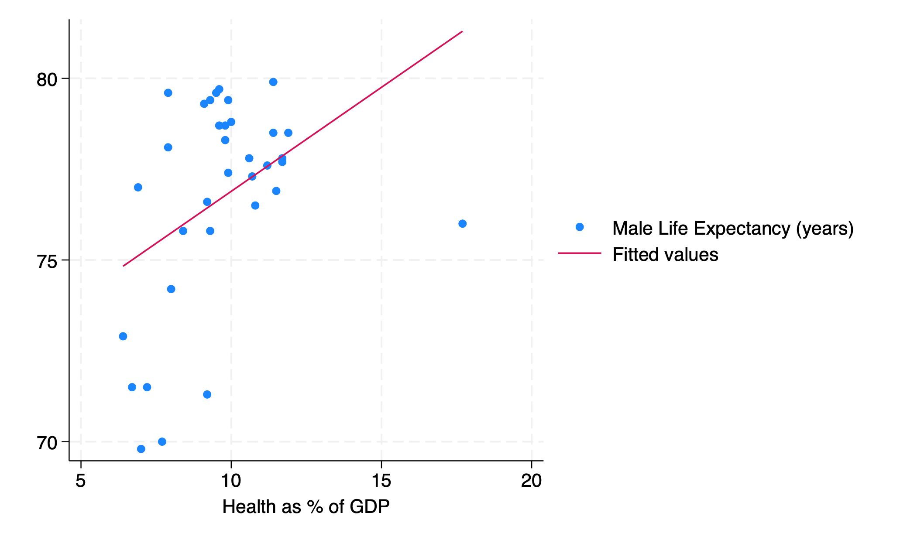

```{r}
#| label: setup
#| include: false
require("Statamarkdown")
```

## Dataset Overview {.smaller shrink=30}

```{stata}
#| label: des
#| collectcode: true
qui u HEALTH2009, clear
des
```

- What would be some sensible explanatory variables? Some outcome variables?

. . .

*hlthgdp, hlthpc, gdppc* might be some sensible independent variables; *infmort, lifeexp* might be some reasonable dependent variables.

## Health Spending Distribution {.smaller shrink=20}

```{stata}
#| label: su-hlthgdp
su hlthgdp, d
```

- How would we describe this variable in words? What are its measures of central tendency? Spread? What do these each mean?

. . .

Our variable has a mean of 9.67 with a median of 9.6, indicating a right-skew. We confirm this with a skewness $>0$. We have thicker tails than a normal distribution with $Kurt>3$. Our standard deviation is 2.12. Our IQR is 10.8-8=2.8.

## Infant Mortality and Life Expectancy {.smaller shrink=20}

\vspace{3em}

```{stata}
#| label: su-infmort
su infmort lifeexp
```

- Which of these two variables has greater spread relative to its mean? How do we know?

. . .

$$CV=\frac{s}{\bar{x}}: \frac{2.72}{4.45} > \frac{2.94}{76.70}\Rightarrow\text{infmort has larger dispersion}$$

- What would we expect the standard error (of $\bar{x}$) of *infmort* to be?

. . .

$$se_{infmort})=\frac{s_{\text{infmort}}}{\sqrt{n}}=\frac{2.72}{\sqrt{34}}$$

## Regression of Life Expectancy on Health Spending {.smaller shrink=30}

\vspace{3em}

Suppose we regress *lifeexp* on *hlthgdp*:

```{stata}
#| label: reg
#| echo: true
reg lifeexp hlthgdp
```

## Population Model and OLS Assumptions {.smaller shrink=20}

\vspace{3em}

Population model:

- What is the population model we are estimating?

. . .

$$y_i = \beta_1 + \beta_2x_i+u_i$$

- What four assumptions do we make to use OLS?

. . .

(1) Linearity, (2) Unbiasedness, (3) Homoskedasticity, (4) Independence

- What would be a potential threat to each assumption?

1. Nonlinear relationship between X and Y

2. An omitted variable in our regression

3. Heteroskedasticity - non-uniform distribution of errors

4. Correlation in our errors between observations

## Sample Estimates 

\vspace{1em}

Sample estimate:

- What is $b_1$? What is $b_2$? What are these in words? What do these estimate?

. . .

$b_1=71.166$ is our intercept; $b_2=0.572$ is our slope. We expect a country that spends 0% of its GDP on health to have a male life expectancy of around 71 years and to gain roughly half a year of life expectancy for each 1% additional of GDP spent on health. These estimate $\beta_1$ and $\beta_2$ from the population model.

- What are two properties of our estimator $b_2$?

. . .

We know our OLS estimator to be both *unbiased* $(E[b_2]=\beta_2)$ and *consistent* $(\sigma^2_{b_2}\rightarrow0\text{ as }n\rightarrow\infty)$.

## More Sample Estimates 

- What is $s_{b_2}$? How is this different from $\sigma_{b_2}$?

. . .

$s_{b_2}$ is the standard error for our slope coefficient, calculated using all sample quantities. Our population standard deviation for $b_2$, $\sigma_{b_2}$, would use population parameters instead ($\sigma_u$ instead of $s_e$).

- What would we expect the male life expectancy to be for a country that spends 7% of its GDP on health?

. . .

$E[Y|X=7]=71.166+0.572\times7=75.17$

## Model Fit 

Model fit:

- What is our ExpSS? Our ResSS? Our TSS?

. . .

$ExpSS=48.78;\ ResSS=235.83;\ TSS=284.61$

- What is our $R^2$? What is $r_{xy}$? What do these each mean?

. . .

$R^2=0.1714;\ r_{xy}=\sqrt{0.1714}=0.41$. 17.14% of our variation in male life expectancy is explained by (variation in) health spending as a % of GDP. The two variables have a moderate positive correlation of 0.41.

## More Model Fit

- Can we say $b_2=r_{xy}$? Why or why not?

. . .

We cannot say $b_2=r_{xy}$ without knowing $s_x$ and $s_y$, since we know $b_2=r_{xy}\frac{s_y}{s_x}$. It is unlikely the two are exactly equal.

- What are two ways we could calculate $R^2$ manually?

. . .

$R^2 = \frac{ExpSS}{TSS}=1-\frac{ResSS}{TSS}=\frac{48.78}{284.61}=1-\frac{235.83}{284.61}=0.1714$

## Bivariate Inference {.smaller}

Bivariate inference:

- Which hypotheses does the t-statistic for $b_2$ correspond to?

. . .

$H_0:\beta_2=0$

$H_A:\beta_2\neq0$

- Can we reject this null hypothesis using the p-value approach?

. . .

Yes; `P>|t|` (the probability of getting a test statistic at least as large if the null hypothesis is true) $=0.015<\alpha=0.05$ so we reject the null. There is a statistically significant association between x and y.

- Can we reject this null using our confidence interval?

. . .

Yes; our parameter value assumed under the null is not included in our confidence interval, so we can reject the null. There is a statistically significant association between x and y.

## Critical Value and Degrees of Freedom {.smaller}

- Without using `invttail()`, what do we know about $t^*_{df,\alpha/2}$, our critical value?

. . .

Since our p-value and critical value approaches must **always** give us the same answer for whether to reject a given null, we know that $t=2.57>t^*_{df,\alpha/2}$ even if we do not know $t^*_{df,\alpha/2}$ itself.

- How many degrees of freedom will our t-statistic above have? Why?

. . .

Our test will have $n-2$ degrees of freedom, because two (2) precomputed quantities are used to calculate our test statistic: $b_1$ and $b_2$.

- State the conclusion of our hypothesis test in words.

. . .

We reject the null and state that there is a statistically significant association between % of GDP spent on health and male life expectancy.

## Scatter Plot {.smaller shrink=20}

\vspace{1em}

```{stata}
#| label: scatter
#| results: false
sc lifeexp hlthgdp || lfit lifeexp hlthgdp
qui gr export scatter.png, replace
```

{width=85% fig-alt="Scatter plot with male life expectancy in years on the vertical axis and health spending as a percentage of GDP on the horizontal axis. Points represent individual OECD countries. A positively sloped fitted regression line is overlaid, showing a general positive association between health spending and life expectancy. The data display considerable spread with residuals appearing larger at lower values of health spending, suggesting possible heteroskedasticity. One prominent outlier appears at the far right of the x-axis with a life expectancy well below the regression line."}

- What do we notice about this regression and data?

. . .

Our data is likely both heteroskedastic (more spread at lower values of x) and has an outlier. We may want to drop the outlier and use robust SEs in our regression.

## Homoskedasticity and Outlier Discussion {.smaller shrink=10}

- Which assumption are we now worried our data might violate?

. . .

We may be worried our data violates homoskedasticity, our third (3rd) assumption. Our errors appear to be larger for smaller values of x.

- What could we do in response to this concern?

. . .

We would need to add the option `,robust` to our regression in Stata.

- What quantity(ies) would be changed as a result of this?

. . .

Our coefficient estimates would not change as a result of using `robust`, but our standard errors would change. T-statistics, p-values, and CIs would also change.

- How would our regression change if we instead excluded the right-most point?

. . .

Our right-most point is significantly below our regression line, indicating it is likely making our $b_2$ much lower than it would be without this point.

## Ordinary Least Squares: BLUE {.smaller shrink=20}

\vspace{3em}

- What does our OLS estimator $b_2$ minimize? What does it maximize?

. . .

Our OLS estimator $b_2$ minimizes the sum of squared residuals, $\sum_{i=1}^ne_i^2$. By definition, it then also maximizes our coefficient of determination, $R^2$.

- We called the OLS estimator **BLUE** - what did this mean?

. . .

This means that our OLS estimator is the **B**est **L**inear **U**nbiased **E**stimator. This means it is (1) unbiased, (2) linear in form, and (3) has minimum variance of all similar estimators. We said (3) was important to minimize Type II error probability.

- Suppose I obtain a sample of data ($n=63$) I am certain is **not** normally distributed. I want to use OLS and conduct inference on $b_2$, but will I be able to? Why or why not?

. . .

The magic of the central limit theorem (CLT) says that a statistic computed from a sample with $n>30$ will be normally distributed, even if the data itself is not normally distributed. The $b_2$ we compute from this data can be expected to follow a normal distribution in this case.
